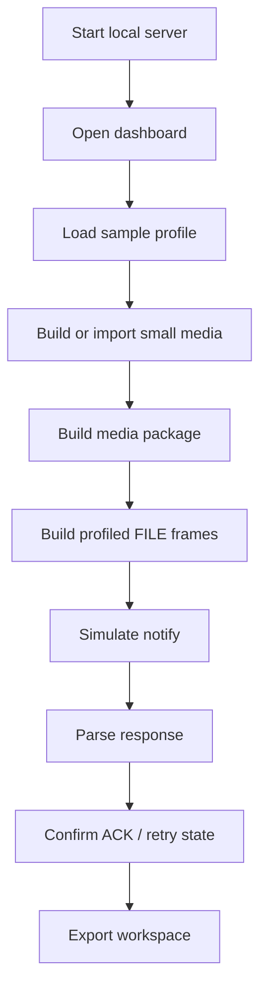
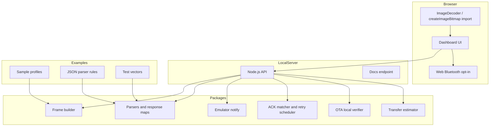

<p align="center">
  
</p>

<h1 align="center">MCard-StarterKit</h1>

<h2 align="center">
  A clean-room playground for Bluetooth animated badge experiments.
</h2>

<p align="center">
  <a href="./LICENSE">
    
  </a>
  <a href="./package.json">
    
  </a>
  <a href="./docs/README.md">
    
  </a>
  <a href="./docs-ja/README.md">
    
  </a>
  
  
</p>

<p align="center">
  <strong>Profile-driven media packaging, frame building, BLE transport experiments, parsers, retry logic, and local emulation for animated badge-like devices.</strong>
</p>

---

## What can it do?

MCard-StarterKit is a public-safe starter kit for experimenting with **Electronic Badge, NFC Bluetooth Animated GIF Trendy Toy Keychain-like devices**.

It helps you build and test the full local workflow around a Bluetooth animated badge without relying on vendor cloud services or captured application code.

```mermaid
flowchart LR
  Profile[Device profile] --> Media[Media / animation]
  Media --> Package[Local package]
  Package --> Frames[CONTROL / FILE / OTA frames]
  Frames --> Transport[Emulator or BLE transport]
  Transport --> Notify[Notify responses]
  Notify --> Parser[Parser / response mapping]
  Parser --> Retry[ACK matcher / retry scheduler]
  Retry --> Workspace[Logs / workspace export]
```



### Feature gallery

| Area | What you can do |
|---|---|
| **Profile Editor** | Edit device-like categories, commands, responses, transfer limits, and media limits as JSON |
| **Media Studio** | Prepare small static display media for badge-style screens |
| **Animation Studio** | Build frame-based animation manifests |
| **Browser-native Media Import** | Import GIF, APNG, WebP, or static image files through browser APIs |
| **Media Package Builder** | Convert local media into package JSON |
| **Profile Frame Lab** | Build profile-driven CONTROL, FILE, and OTA planning frames |
| **FILE Transfer Simulator** | Split packages into transfer frames and inspect packet plans |
| **Notify Parser Lab** | Parse notification hex into normalized response objects |
| **JSON Rule Parser Lab** | Add safe parser behavior with JSON rules instead of executable plugins |
| **Retry Scheduler Lab** | Test ACK/NACK, lost packet, and retry state behavior |
| **Emulator Notify Simulator** | Generate virtual notifications without hardware |
| **Web Bluetooth Transport** | Write frames through browser BLE only after explicit user confirmation |
| **Windows BLE Peripheral Sample** | Run a local GATT peripheral sample for transport testing on Windows |
| **OTA Local Verifier** | Build and verify synthetic local package containers without flashing firmware |
| **Transfer-time Estimator** | Estimate transfer duration from profile settings and packet counts |
| **Workspace Tools** | Export/import local project state for repeatable experiments |

## What it is not

MCard-StarterKit is not a vendor app clone, firmware flasher, cloud client, or production hardware certification package.

```text
No vendor cloud calls
No official assets
No captured application code
No firmware blobs
No private identifiers
No automatic BLE writes
```

## Safety summary

- Local-first.
- No vendor cloud calls.
- No official assets.
- No captured application code.
- No firmware blobs.
- BLE writes are opt-in.
- OTA tooling is local verification and planning only.

## 5-minute Quickstart

```bash
npm test
PORT=3000 npm start
```

Open:

```text
http://127.0.0.1:3000
```

Health check:

```bash
curl -s http://127.0.0.1:3000/api/health
```

Expected response:

```json
{
  "ok": true
}
```

### First local success path



### Minimal API check

After `PORT=3000 npm start`, this response parser smoke check should return `matched: true`:

```bash
curl -s -X POST http://127.0.0.1:3000/api/response/parse \
  -H "Content-Type: application/json" \
  -d '{"group":"file","hex":"04 00 0a 00 09 00 06 00 00 00 01 00 00 00"}'
```

## Architecture



## Repository map

```text
apps/
  web/                         local dashboard
  windows-ble-peripheral/      Windows GATT peripheral sample

packages/
  frame-builder/               profile-driven frame creation
  notify-parsers/              notification parser registry
  response-mapping/            FILE / OTA response mapping
  control-response-mapping/    CONTROL response mapping
  retry-scheduler/             retry state machine
  ack-matcher/                 per-packet ACK matching
  transport/                   transport abstraction
  transport-adapters/          log adapters
  emulator-notify/             virtual notify generator
  ota-local-verifier/          synthetic package verifier
  media-tools/                 media estimates and frame planning
  transfer-estimator/          transfer-time estimates
  json-rule-parser/            safe JSON parser rules

examples/
  profiles/                    sample profiles
  plugins/                     JSON rule parser examples
  responses/                   response fixtures
  test-vectors/                protocol vectors

docs/
  English documentation

docs-ja/
  Japanese documentation
```

## Documentation

| Document | Description |
|---|---|
| [User guide](docs/USER_GUIDE.md) | First dashboard workflow with panel names, actions, and expected outputs |
| [Developer guide](docs/DEVELOPER_GUIDE.md) | Code reading order, module responsibilities, examples, and change checklists |
| [MoniCard-like profile notes](docs/MONICARD_LIKE_PROFILE_NOTES.md) | Public-safe compatibility model and implementation mapping |
| [Protocol reference](docs/PROTOCOL_REFERENCE.md) | Byte-level frame shapes, hex examples, offset tables, and parse results |
| [Media guide](docs/MEDIA_GUIDE.md) | Browser-native import, package generation, and estimator notes |
| [Transport guide](docs/TRANSPORT_GUIDE.md) | Emulator, Web Bluetooth, Windows peripheral, logs, and retry flow |
| [Hardware planning](docs/HARDWARE.md) | BOM, bring-up order, and hardware caution notes |
| [Security model](docs/SECURITY.md) | Clean-room boundaries, threat model, and BLE safety rules |

Japanese docs are available in [`docs-ja/`](docs-ja/README.md).

## Clean-room policy

Do not add:

- vendor endpoints,
- official assets,
- captured application code,
- firmware blobs,
- private identifiers,
- HAR files,
- extracted package artifacts.

When behavior is device-specific, put it in profiles, JSON rules, fixtures, or documentation. Keep generic packages profile-driven.

## Development

```bash
npm test
npm start
```

Before opening a pull request, see [`CONTRIBUTING.md`](CONTRIBUTING.md).

## License

MIT. See [`LICENSE`](LICENSE).

---

<p align="center">
  Built for local experiments, tiny screens, packet puzzles, and the particular joy of making plastic rectangles blink on purpose.
</p>
