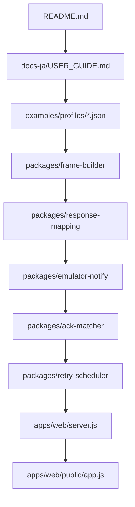
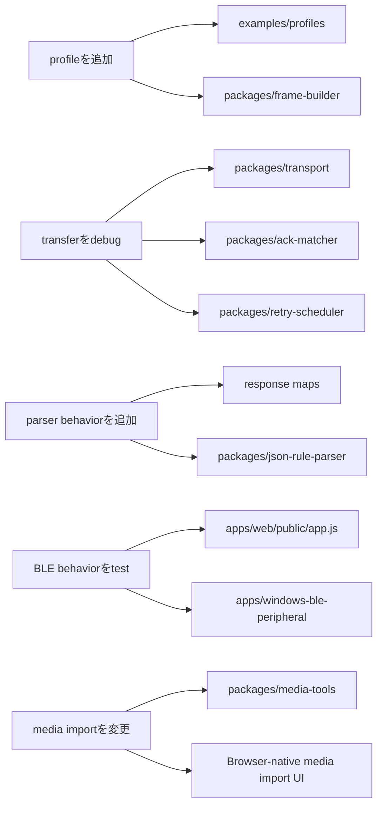
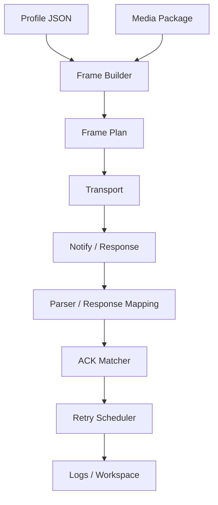

# 開発者ガイド

このガイドは、コード全体を読む前にMCard-StarterKitの内部構造を把握したい開発者向けです。

## おすすめの読む順番



この図は上から下へ読みます。まずdashboardの流れを確認し、sample profileがframe生成、response parse、ACK matching、retry stateへどう流れるかを追います。

## 目的別の入口



変更したい対象に近いbranchを選び、対応するpackageやexampleから読み始めます。

## 全体像



profileとmediaからframe planを作り、transportからnotificationを受け取り、parserで正規化し、matcherとschedulerでtransfer stateを更新します。

## 設計方針

MCard-StarterKitは次の4つのルールで構成されています。

1. **Profile-driven behavior**  
   デバイス固有の値はJSON profileへ置き、core moduleへ固定値を書き込みません。

2. **Local-first execution**  
   dashboard、frame builder、parser、emulator、verifierはローカルで動作します。

3. **Explicit transport actions**  
   BLE操作はopt-inにします。page load時に自動scanや自動writeをしません。

4. **Clean-room boundaries**  
   vendor cloud endpoint、official asset、captured app code、firmware blob、private identifier、extracted package artifactを含めません。

## リポジトリ構成

```text
apps/
  web/
    server.js                 local dashboard server
    public/
      index.html              dashboard UI
      app.js                  browser-side workflow logic

  windows-ble-peripheral/
    MCardBlePeripheral/       Windows GATT peripheral source sample
    scripts/                  PowerShell build/run helpers

packages/
  frame-builder/              profile-driven frame creation
  notify-parsers/             notification parser registry
  response-mapping/           FILE / OTA response mapping
  control-response-mapping/   CONTROL response mapping
  retry-scheduler/            ACK/NACK retry state machine
  ack-matcher/                per-packet ACK matching
  transport/                  transport abstraction and memory transport
  transport-adapters/         log normalization adapters
  emulator-notify/            virtual notify generator
  ota-local-verifier/         synthetic package builder/verifier
  media-tools/                size estimates and frame optimization planning
  transfer-estimator/         profile-specific transfer-time estimates
  json-rule-parser/           safe JSON parser rules

examples/
  profiles/                   sample device profiles
  plugins/                    JSON rule parser examples
  test-vectors/               protocol-level examples
```

## 便利なexamples

| File | 役割 |
|---|---|
| `examples/profiles/monicard-like.sample.json` | categories、commands、response maps、transfer settingsを含むsample profile |
| `examples/test-vectors/protocol-vectors.json` | frameとparser behavior用のprotocol examples |
| `examples/plugins/monicard-like-file-ack.rules.json` | JSON rule parser example |
| `examples/responses/monicard-like-file-data-response.hex` | FILE response fixture |
| `examples/responses/monicard-like-ota-data-response.hex` | OTA response fixture |
| `examples/emulator/notify-scenario.json` | emulator notify scenario |
| `examples/workspace/minimal-workspace.json` | minimal workspace shape |

## 中心となるデータ構造

### Profile

Profileは中心となるconfiguration objectです。以下を定義できます。

```text
id
title
categories
frameModes
controlCommands
fileCommands
otaCommands
controlResponses
fileResponses
otaResponses
transfer
ota
media
notifyParsers
```

coreはprofileをdataとして扱います。別のbadge-like targetを追加する場合、通常はcore codeを書き換えるのではなくprofileを追加します。

### Media package

Media packageはstatic mediaまたはanimated mediaを表すlocal JSON objectです。firmware imageではありません。

### Frame plan

Frame planはlocal transfer planです。packet size、total packets、payload sizes、generated frame hexなどを含みます。

### Parsed response

Response parserは次のような正規化済み構造を返します。

```text
matched
group
type
command
commandName
requestCommandName
status
value
dataHex
rawHex
message
```

SchedulerとACK matcherは、parser固有の内部形式ではなく、この正規化済み構造を受け取ります。

## moduleの責務

| Module | Responsibility |
|---|---|
| `packages/frame-builder` | profile dataとbytesからframe bytesを作る |
| `packages/notify-parsers` | raw notification shapeをparseする |
| `packages/response-mapping` | FILE / OTA response frameをmapする |
| `packages/control-response-mapping` | CONTROL response frameをmapする |
| `packages/retry-scheduler` | retry stateを管理する |
| `packages/ack-matcher` | parsed ACK/NACKをin-flight packetへ対応付ける |
| `packages/transport` | transport behaviorを定義・testする |
| `packages/emulator-notify` | virtual notificationを生成する |
| `packages/ota-local-verifier` | synthetic local packageをbuild/verifyする |
| `packages/json-rule-parser` | safe JSON rulesでnotificationをparseする |

## local server APIs

代表的なendpoint。

```text
GET  /api/health
GET  /api/docs
GET  /api/profiles
GET  /api/profile?path=...

POST /api/file/frames
POST /api/file/frames-profiled
POST /api/frame/build-profiled
POST /api/ota/frames-profiled

POST /api/notify/parse
POST /api/notify/parse-and-schedule
POST /api/response/parse
POST /api/control/parse-response
POST /api/json-rules/parse

POST /api/retry/run
POST /api/emulator/notify
POST /api/ota/build-local
POST /api/ota/verify-local
POST /api/transfer/estimate
POST /api/transport/adapt-log
POST /api/workspace/migrate
```

server endpointはlocalでdeterministicに保ちます。外部network callは避けます。

## 変更時チェックリスト

### 新しいprofileを追加する

- `examples/profiles/<name>.sample.json` を追加する。
- `categories` を定義する。
- `frameModes` を定義する。
- command mapsを定義する。
- response mapsを定義する。
- transfer limitsを定義する。
- fixtureまたはtest vectorを少なくとも1つ追加する。
- `npm test` を実行する。

### parser behaviorを追加する

- まずprofile response mapsで表現できるか確認する。
- 次にJSON rule parserで表現できるか確認する。
- executable parser codeは必要な場合だけ追加する。
- fixture hexを追加する。
- parser testを追加する。
- `npm test` を実行する。

### frame behaviorを追加する

- profile固有のconstantをcore moduleへ入れない。
- sample profile dataを追加する。
- protocol vectorを追加する。
- frame builder testを追加する。
- public behaviorが変わる場合は `docs-ja/PROTOCOL_REFERENCE.md` も更新する。

### media importを変更する

- browser APIの前提をdocumentする。
- sizeやmemory caveatを追加する。
- media tools testsを追加または更新する。
- package estimatorが動作することを確認する。

## 公開PR前チェックリスト

実行します。

```text
npm test
```

確認項目。

- public behaviorが変わる場合はdocsを更新した。
- 新しいprotocol behaviorにはtestまたはfixtureがある。
- device-specific constantsはprofileに置いた。
- executable parser codeよりJSON rulesを優先した。
- vendor endpoint、official asset、captured app code、firmware blob、private identifier、extracted artifactを追加していない。
