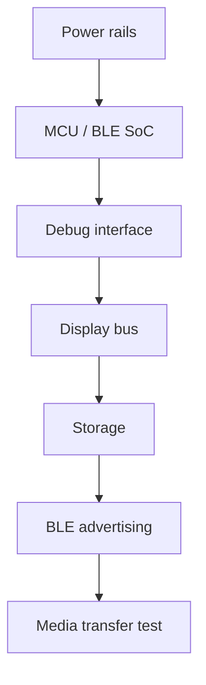

# Hardware planning

この文書はhardware planning用の入口です。認証済み設計ではありません。

hardware filesは `hardware/` 配下に置きます。

## Included planning files

- `hardware/bom/bom-template.csv`
- `hardware/notes/bringup-checklist.md`
- `hardware/pcb/reference-block-diagram.md`
- `hardware/enclosure/enclosure-notes.md`

## Hardware BLE emulator example

local dashboardのtransport test用physical peripheral/serverとして、2つの
PlatformIO exampleを用意しています。

- `examples/esp32-ble-peripheral/`: `esp32dev` compatible board用
- `examples/nrf52-ble-peripheral/`: `nrf52840_dk_adafruit` PlatformIO board
  targetを使うnRF52840 DK用

build command:

```bash
pio run -d examples/esp32-ble-peripheral
pio run -d examples/nrf52-ble-peripheral
```

各exampleのREADMEにupload、serial monitor、dashboard接続手順があります。どちらも
neutral sample serviceと、分離されたwrite/notify characteristic UUIDだけをadvertise
します。centralが接続し、notificationを有効化し、有効なframeを明示的にwriteした
場合だけdeterministic notificationを返します。

これらはpublic-safeでunofficialなcompatibility emulatorです。OTA categoryはsample
planning ACKを返すだけで、実デバイスへのfirmware flashingは行いません。

## Prebuilt release package

GitHub Actions workflow
`.github/workflows/hardware-emulator-release.yml` が両方のboard exampleをbuildします。
`v*` tagではboard別ZIP fileと `SHA256SUMS` を対応するGitHub Releaseへ公開します。
workflowの手動実行ではtemporary Actions artifactだけを生成します。

Release packageにはtagged public sourceから生成したbinary、対応するconfig/source、
checksum、target別flashing noteが含まれます。vendor firmwareや別device用firmwareは
含みません。

## Reminder

これらはplanning aidsであり、certified schematic、production drawing、safety approvalではありません。

## Recommended bring-up order



## Cautions

- current-limited powerから始めます。
- batteryを接続する前にcharger behaviorを確認します。
- antenna zoneにはmetalやdense ground structureを近づけすぎないようにします。
- display currentとbacklight thermal behaviorはdesign constraintsとして扱います。
- planning filesをcertification evidenceとして扱わないでください。
