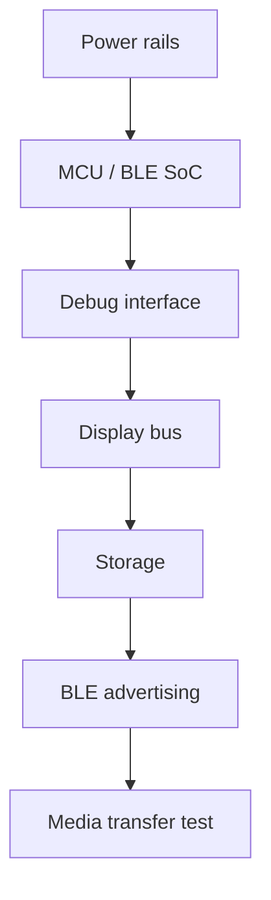

# Hardware planning

この文書はhardware planning用の入口です。認証済み設計ではありません。

hardware filesは `hardware/` 配下に置きます。

## Included planning files

- `hardware/bom/bom-template.csv`
- `hardware/notes/bringup-checklist.md`
- `hardware/pcb/reference-block-diagram.md`
- `hardware/enclosure/enclosure-notes.md`

## Reminder

これらはplanning aidsであり、certified schematic、production drawing、safety approvalではありません。

## Recommended bring-up order

## Cautions

- current-limited powerから始めます。
- batteryを接続する前にcharger behaviorを確認します。
- antenna zoneにはmetalやdense ground structureを近づけすぎないようにします。
- display currentとbacklight thermal behaviorはdesign constraintsとして扱います。
- planning filesをcertification evidenceとして扱わないでください。
