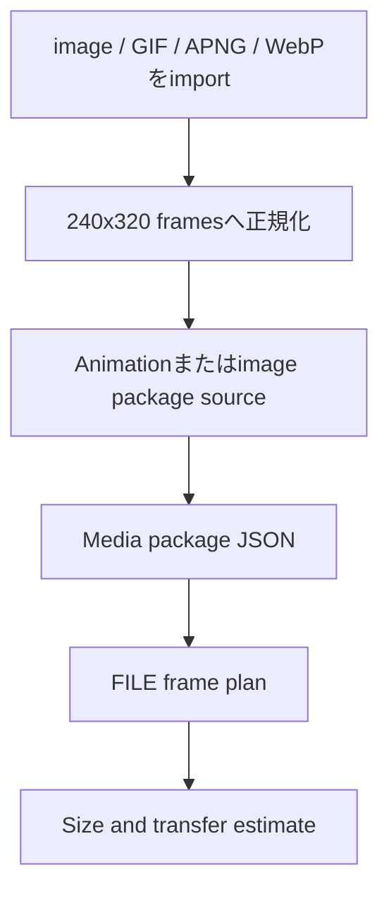

# メディアとパッケージ

この文書は、media import、animation、package、transfer estimateの考え方を説明します。

## Static media

static imageは、240x320 display向けのworkflowに正規化されます。

## Animated media

animationは、frame manifestと各frameのdurationで表現します。

Browser-native importは次の順で使います。

1. 利用可能なら `ImageDecoder`
2. fallbackとして `createImageBitmap`

標準ではthird-party decoderを同梱しません。

## Package estimation

dashboardでは以下を見積もれます。

- approximate payload bytes
- frame count
- transfer bytes
- profile size warnings

## OTA local verifier

synthetic `.mcot` packageはlocalでbuild/verifyできます。verifierはstructure、image table data、hash、CRCを確認します。

verifierはfirmware flashing toolではありません。

## Media pipeline

## Browser-native importの制限

- GIF animation supportは `ImageDecoder` supportに依存します。
- APNG supportはbrowserごとに異なります。
- animated WebP supportもbrowserごとに異なります。
- fallback modeではstatic frameのみdecodeされる場合があります。
- importされたframeはPNG data URLへ正規化されます。
- 大きなanimationはmemory pressureを起こす可能性があります。

## importが重い場合

- max framesを減らす。
- minimum durationを増やす。
- まずstatic imageで試す。
- package size estimatorを見る。
- transfer-time estimatorを見る。
