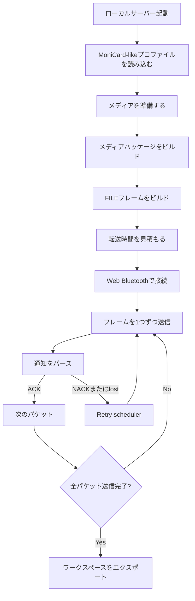

# MoniCardデバイスで試す

このガイドでは、MCard-StarterKitを使って物理的なMoniCard-like BLEディスプレイバッジにメディアフレームを送信する方法を説明します。

ローカルサーバーの起動から実機からの通知パースまで、一通りの流れをカバーします。ハードウェアがない場合はステップ6で止まり、代わりにEmulator Notify Simulatorを使ってください。その後の流れは同じです。

## 前提条件

| 必要なもの | 備考 |
|---|---|
| Node.js 18以上 | `node --version` で確認 |
| Chromiumベースのブラウザ | ChromeまたはEdge — Web Bluetoothに必要 |
| MoniCard-likeデバイス | 充電済みかつBLE圏内に置く |
| クラウドアカウント不要 | すべてローカルで動作 |

## 安全に関する注意

- このキットはclean-roomのみで動作します。vendor cloud endpoint、captured app code、firmware blobは一切含まれません。
- Web Bluetoothの書き込みは常にopt-inです。ブラウザがデバイス選択ダイアログを表示し、接続のたびに確認が必要です。
- OTA機能はローカルでのplanning・verificationのみです。このキットは他のデバイスにfirmwareをflashしません。

詳細は[Security model](SECURITY.md)を参照してください。

## ステップ1: インストールとサーバー起動

```bash
npm install
PORT=3000 npm start
```

起動確認:

```bash
curl -s http://127.0.0.1:3000/api/health
```

期待値:

```json
{ "ok": true }
```

ブラウザでダッシュボードを開きます:

```text
http://127.0.0.1:3000
```

## ステップ2: MoniCard-likeプロファイルを読み込む

パネル: **Profile Editor**

操作:
```text
Load  →  examples/profiles/monicard-like.sample.json
```

読み込み後に表示されるフィールド:

```text
categories
fileCommands
controlCommands
otaCommands
transfer
```

このプロファイルがframe shape、categoryバイト値、commandコード、packet sizingを設定します。デバイス固有の値はすべてこのファイルから実行時に読み込まれます。コアコードの編集は不要です。

デバイスが異なるUUIDやcommand codeを使っている場合は、サンプルファイルを複製して編集してください。オリジナルは変更しないことを推奨します。

## ステップ3: メディアを準備する

送りたいコンテンツに応じてパネルを選びます:

| 目的 | パネル | 操作 |
|---|---|---|
| 静止画（PNG/JPEG） | Media Studio | 240×320の画像を読み込む |
| 短いアニメーション | Animation Studio | frame animation manifestを作成 |
| GIF / APNG / WebP | Browser-native Media Import | ファイルを選択 → Import native media |

期待値: ダッシュボードにlocal mediaまたはanimation sourceが表示されます。

サンプルプロファイルは240×320のポートレートディスプレイを想定しています。プロファイルに別のサイズを宣言すれば他のサイズも使えます。

## ステップ4: メディアパッケージをビルドする

パネル: **Media Package Builder**

操作:
```text
Build media package
```

期待値: Package JSONがpackage出力エリアに表示されます。`byteLength`と`crc`フィールドを確認してください。これらはFILE send-startフレームで使われます。

## ステップ5: FILEフレームをビルドする

パネル: **Profile Frame Lab** または **FILE Transfer Simulator**

操作:
```text
Build profiled frames
```

期待値:

```json
{ "totalPackets": 1 }
```

`totalPackets`が0でなければ、パッケージが転送可能なフレームに分割されたことを示します。フレームプランにはパケットごとのバイト内容とインデックスが表示されます。

## ステップ6: 転送時間を見積もる（任意）

パネル: **Transfer-time Estimator**

フレームプランまたはpacket countを入力します。estimatorはアクティブなプロファイルのMTUとwrite-rateの仮定をもとにおおよその所要時間を算出します。

あくまでも概算です。実際のタイミングはconnection interval、ACK delay、ブラウザのBLE動作によって異なります。

## ステップ7: Web Bluetoothでデバイスに接続する

> Web BluetoothにはChromiumベースのブラウザ（ChromeまたはEdge）が必要です。SafariとFirefoxは非対応です。

パネル: **Web Bluetooth Transport**

手順:

1. MoniCard-likeデバイスの電源を入れます。
2. コンピューターの2〜3m以内に置きます。
3. **Connect**をクリックします。
4. ブラウザのデバイス選択ダイアログが開きます。リストからデバイスを選択します。
5. **Pair**をクリックします。

シリアルモニターが接続されている場合の期待出力:

```text
BLE connected
```

ダッシュボードはBLE centralとして動作し、デバイスがperipheral/serverとして機能します。

サンプルプロファイルは以下のneutral UUIDを使用します:

```text
Service:  7a2f0000-2b3c-4d5e-8f90-000000000000
Write:    7a2f0002-2b3c-4d5e-8f90-000000000000
Notify:   7a2f0003-2b3c-4d5e-8f90-000000000000
```

デバイスが異なるUUIDを使っている場合は、接続前にローカルのプロファイルコピーを更新してください。

## ステップ8: デバイスにフレームを送信する

パネル: **Web Bluetooth Transport**（接続後、同じパネル）

操作:
```text
Send next packet
```

ダッシュボードは1フレームずつ書き込み、次に進む前に通知を待ちます。これは意図的な設計です。入力バッファが小さいデバイスでのオーバーランを防ぎます。

期待される動作:

```text
フレーム書き込み → デバイスがFILE ACK notifyを送信 → ダッシュボードがparseする → 次のパケットがキューに入る
```

自動ACK待機でパケットを連続送信したい場合は**Send all packets**を使い、schedulerの状態を監視してください。

## ステップ9: 通知をパースする

パネル: **FILE / OTA Response Parser**

transportパネルで通知が自動的にパースされなかった場合は、ここに生のhexを貼り付けます:

```text
04 00 0a 00 09 00 06 00 00 00 01 00 00 00
```

期待値:

```json
{
  "matched": true,
  "command": "FILE_SEND_DATA_RESPONSE",
  "status": 0,
  "packetIndex": 1
}
```

`status: 0`は成功を示します。0以外はNACKまたはエラーです。その場合はステップ10へ。

## ステップ10: リトライを処理する

パネル: **Retry Scheduler Lab**

パケットが失われたりデバイスがNACKを送信した場合:

1. schedulerがパケットを`retry`状態にします。
2. **Apply notification**を使ってパースした通知を反映させます。
3. デバイスがlost-packet reportを送信した場合、schedulerは不足インデックスを再送キューに入れます。
4. **Send next packet**で再送します。

retry state machineはprofile-drivenです。リトライ上限とタイミングはアクティブなプロファイルの`transfer`セクションから読み込まれます。

## ステップ11: ワークスペースをエクスポートする

パネル: **Workspace**

操作:
```text
Export workspace
```

現在のプロファイル、フレームプラン、parserの状態、schedulerのログをローカルJSONファイルとして保存します。同じセッションを後で再現したり、テストケースを共有するのに使えます。

## トラブルシューティング

| 症状 | 確認事項 |
|---|---|
| ダッシュボードが開かない | `PORT=3000 npm start`が実行中か確認 |
| デバイスがブラウザのピッカーに表示されない | アドバタイズしていない — デバイスを起こすか近づける |
| parserで`matched: false` | プロファイルのcategory、command、response mapがデバイスと一致しているか確認 |
| BLE接続がすぐ失敗する | Chromiumブラウザが必要。OSのBLEが有効か確認 |
| パケットは送れるが画面が変わらない | session-endフレームが必要な可能性。フレームプランの`FILE_SEND_END_REQUEST`を確認 |
| 最初のパケット後に転送が止まる | プロファイルの`transfer.ackTimeoutMs`でACKタイムアウトを延ばす |
| UUIDが合わない | ローカルのプロファイルコピーのservice/write/notify UUIDを更新 |

## デバイスが応答しない場合

1. シリアルモニターが接続されている場合は出力を確認します。firmware skeletonは各フレームの`[RX]`と`[TX]` hexをprintします。
2. まずCONTROL PINGを試します（フレーム`1f 00 02 00 00 00`）。最小の有効フレームで、書き込みパスが機能しているか確認できます。
3. notificationがsubscribeされているか確認します。Web Bluetoothはデバイスが送信する前にnotificationを有効化する必要があります。
4. デバイスを再起動して再接続します。

## フロー全体図



## 関連ドキュメント

- [ユーザーガイド](USER_GUIDE.md) — emulatorのみのパス、ハードウェア不要
- [Transport guide](TRANSPORT_GUIDE.md) — BLE transport詳細、Windows peripheral、ESP32/nRF52 emulator
- [プロトコル仕様](PROTOCOL_REFERENCE.md) — フレームのバイトレイアウトとhex例
- [MoniCard-like profile notes](MONICARD_LIKE_PROFILE_NOTES.md) — profile model、frame family、clean-room line
- [Security model](SECURITY.md) — BLE安全ルールとclean-room境界
