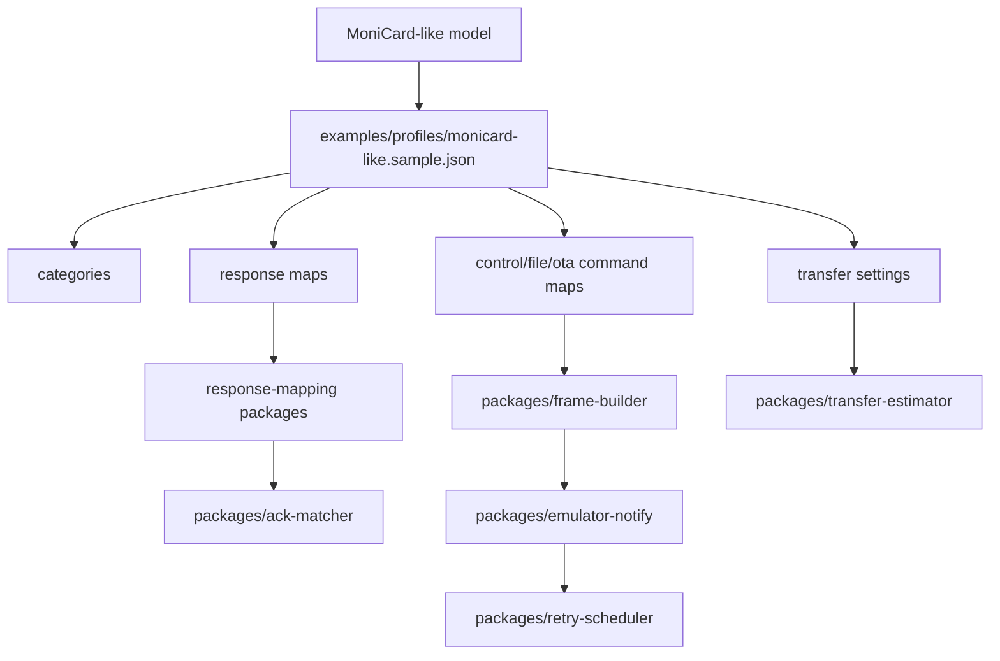

# MoniCard-like profile notes

この文書は、このstarter kitで使う公開安全なMoniCard-like compatibility modelを説明します。

vendor cloud details、private identifiers、captured application code、official assets、firmware blobs、extracted package artifactsは扱いません。ここにある内容は、user-owned badge実験向けのclean-room compatibility profileとして扱ってください。vendor specificationではありません。

## Confidence labels

この文書では次のlabelを使います。

| Label | Meaning |
|---|---|
| Model rule | このstarter kitのpublic compatibility modelで使う挙動 |
| Sample value | public sample profileで使う中立的な値 |
| Compatibility assumption | clean-room experimentation用の実用的な形。vendor guaranteeではない |
| Safety boundary | このrepositoryが越えない境界 |

この文書のcategory values、command names、UUIDs、packet formulas、response layoutsはprofile model上のdetailです。universal constantsやvendor specificationとして扱わないでください。

## Implementation mapping



| Concept | Public implementation location |
|---|---|
| Category values | `examples/profiles/monicard-like.sample.json` の `categories` |
| CONTROL command names | sample profileの `controlCommands` |
| FILE command names | sample profileの `fileCommands` |
| OTA command names | sample profileの `otaCommands` |
| CONTROL responses | `controlResponses` と `packages/control-response-mapping` |
| FILE / OTA responses | `fileResponses`、`otaResponses`、`packages/response-mapping` |
| Packet index behavior | `transfer.includePacketIndex`、`packetIndexBytes`、`packetIndexBase` |
| Packet sizing | `transfer.packetFormula`、`minPacketSize`、`maxPacketSize` |
| CRC-32/MPEG-2 | `packages/frame-builder` と `packages/ota-local-verifier` |
| ACK matching | `packages/ack-matcher` |
| Retry behavior | `packages/retry-scheduler` |
| Virtual notify behavior | `packages/emulator-notify` |
| Windows peripheral sample | `apps/windows-ble-peripheral/MCardBlePeripheral` |
| Safe parser extensions | `examples/plugins/*.rules.json` と `packages/json-rule-parser` |

## Scope

このprofile modelでは、小さなBLE display badgeが次のような挙動を持つものとして扱います。

```text
basic device informationを返す
media-like FILE transferを受け付ける
synthetic OTA planning frameを受け付ける
notification frameを返す
display contentを保存またはrotateする
simple control settingsを扱う
```

## BLE shape

**Label: Compatibility assumption / Sample value.**

互換workflowは、write/notify behaviorを持つprimary custom serviceとしてmodel化できます。

public sample UUID。

```text
service: 7a2f0000-2b3c-4d5e-8f90-000000000000
write:   7a2f0002-2b3c-4d5e-8f90-000000000000
notify:  7a2f0002-2b3c-4d5e-8f90-000000000000
```

real deviceでは異なるUUIDを使う可能性があります。UUIDはprofileまたはlocal settingsに置きます。

## Frame family

**Label: Model rule.**

transportは3つのcommand familyとしてmodel化できます。

```text
CONTROL
FILE
OTA
```

sample category values。

```text
OTA     0x01
FILE    0x04
CONTROL 0x1f
```

これらはprofile valuesです。core codeへ固定しないでください。

## Outer frame

すべてのframe familyはcompactなouter envelopeを共有します。

```text
uint8  category
uint8  fragmentState
uint16 payloadLengthLE
bytes  payload
```

Fragment state values。

```text
0 complete frame
1 first fragment
2 middle fragment
3 last fragment
```

## CONTROL payload

CONTROL framesはcommandとdataを使います。

```text
uint16 commandLE
bytes  data
```

よくあるCONTROL concepts。

```text
serial number query
version query
battery query
storage information query
control settings query
control settings write
card/content metadata query
card/content metadata write
carousel or rotation interval query
carousel or rotation interval write
```

response payloadは次のいずれかとしてdecodeできることが多いです。

```text
ASCII/UTF-8 string
u16le scalar
u32le scalar
bit/flag bytes
small fixed struct
```

## FILE payload

FILE framesはcommand、data length、dataを使います。

```text
uint16 commandLE
uint16 dataLengthLE
bytes  data
```

Typical FILE transfer stages。

```text
session start
send-start metadata
data packet
send-end
session end
lost-packet check
file information query
```

data packetには、content bytesの前にlittle-endian packet indexを含められます。sample transfer builderではpacket index base 1を使います。

## OTA payload

OTA planning framesはFILE framesと同じlength-prefixed command shapeを使います。

```text
uint16 commandLE
uint16 dataLengthLE
bytes  data
```

Typical OTA planning stages。

```text
OTA start
OTA data packet
OTA end
```

このstarter kitではOTAはlocal verificationとplanningだけを扱います。firmware flashは行いません。

## Packet sizing

**Label: Compatibility assumption.**

practical packet sizeはMTUから導出できます。

sample formula。

```text
packetSize = 50 * (mtu - 7) - 8
```

safe rangeへclampします。

```text
minimum: 256
maximum: 10240
```

これはprofile parameterであり、universal BLE ruleではありません。

## CRC behavior

**Label: Model rule for the included public implementation.**

FILE package helperではCRC-32/MPEG-2を使います。

Parameters。

```text
poly:      0x04C11DB7
init:      0xffffffff
reflected: false
xorout:    0x00000000
```

Test vector。

```text
"123456789" -> 0x0376e6e7
```

## Padding behavior

FILE payload dataは、CRC dataを追加する前に4-byte boundaryへpaddingできます。

public implementationでは、これはpackage-builder behaviorとして扱います。別profileは別のruleを選べます。

## ACK and response behavior

compatible notification responseは次のようにmodel化できます。

```text
outer frame
  -> response command
  -> response data length
  -> response data
```

FILE / OTA ACK-style responseでは、dataを次の形として扱えます。

```text
uint16 statusLE
uint32 packetIndexLE
```

sample parserではstatus zeroをsuccessとして扱います。profileが別の意味を定義しない限り、non-zero statusはNACKまたはerrorとして扱います。

## Lost-packet checks

lost-packet responseは次のように表せます。

```text
uint16 statusLE
uint32 lostPacketIndexLE[]
```

retry schedulerはこのlistを使って再送queueを作れます。

## Media assumptions

compatible display profileでは、だいたい次を想定します。

```text
small color display
portrait-oriented content
static image or frame animation
bounded package size
limited write throughput
```

sample toolsはmediaを240x320 PNG framesへ正規化しますが、profileは別のlimitsを宣言できます。

## Transfer timing

transfer timingは次に依存します。

```text
MTU
write rate
connection interval
ACK delay
retry rate
packet count
frame byte count
browser BLE behavior
device storage speed
```

estimatorは近似です。real hardwareで検証してください。

## Response mapping strategy

response mapsをprofile JSONへ置くことを優先します。

```text
controlResponses
fileResponses
otaResponses
```

response mapで表現しきれない場合は、executable parser codeを追加する前にJSON rule parser filesを使います。

## Clean-room line

**Label: Safety boundary.**

Allowed。

```text
public-safe frame shapes
neutral sample UUIDs
profile-driven command names
locally generated test vectors
synthetic package containers
user-owned device experiments
```

Not allowed。

```text
vendor cloud endpoints
private identifiers
official assets
captured application code
firmware blobs
extracted package artifacts
```

## Implementation hint

device-specificに見えるbehaviorは、次へ置いてください。

```text
examples/profiles/*.json
examples/plugins/*.rules.json
docs/MONICARD_LIKE_PROFILE_NOTES.md
```

generic core modulesへ置くのは避けます。
