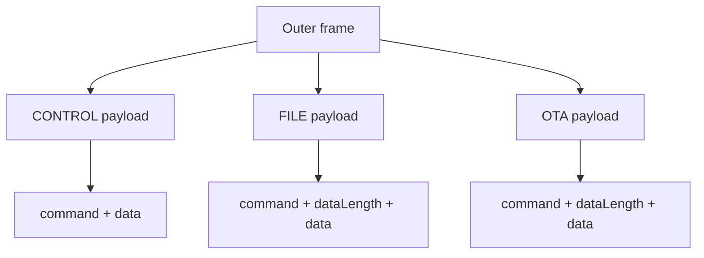

# プロトコル仕様

このprojectは、小さなprofile-driven frame protocolを扱います。

この文書のmulti-byte integer例は、明記がない限りlittle-endianです。

## Frame layers



## Outer frame

```text
uint8  category
uint8  fragmentState
uint16 payloadLengthLE
bytes  payload
```

Fragment states。

```text
0 complete
1 first
2 middle
3 last
```

Validation rule。

```text
complete frameおよびfirst frameでは、payloadLengthLEはactual payload lengthと一致するべきです。
```

## CONTROL payload

```text
uint16 commandLE
bytes  data
```

CONTROL request例。

```text
1f 00 02 00 14 00
```

Decoded。

```json
{
  "category": 31,
  "fragmentState": 0,
  "payloadLength": 2,
  "command": 20
}
```

sample profileでは、command `20` はversion queryを表します。

CONTROL response例。

```text
1f 00 07 00 15 00 30 2e 31 2e 30
```

Parsed result shape。

```json
{
  "matched": true,
  "group": "control",
  "command": 21,
  "commandName": "VERSION_RESPONSE",
  "value": "0.1.0"
}
```

## FILE / OTA payload

```text
uint16 commandLE
uint16 dataLengthLE
bytes  data
```

FILE data response ACK例。

```text
04 00 0a 00 09 00 06 00 00 00 01 00 00 00
```

Decoded。

```json
{
  "category": 4,
  "fragmentState": 0,
  "payloadLength": 10,
  "command": 9,
  "dataLength": 6,
  "status": 0,
  "packetIndex": 1
}
```

Normalized parse result。

```json
{
  "matched": true,
  "group": "file",
  "type": "ack",
  "commandName": "FILE_SEND_DATA_RESPONSE",
  "value": {
    "status": 0,
    "packetIndex": 1
  }
}
```

OTA data response ACK例。

```text
01 00 0a 00 29 00 06 00 00 00 01 00 00 00
```

Normalized parse result。

```json
{
  "matched": true,
  "group": "ota",
  "type": "ack",
  "commandName": "OTA_DATA_RESPONSE",
  "value": {
    "status": 0,
    "packetIndex": 1
  }
}
```

## Categories

sample profileでは以下を使います。

```text
OTA     0x01
FILE    0x04
CONTROL 0x1f
```

これらの値はprofile dataです。core codeはprofile-drivenに保ちます。

## CRC

FILE package payload helperではCRC-32/MPEG-2を使います。

```text
poly:      0x04C11DB7
init:      0xffffffff
reflected: false
xorout:    0x00000000
```

Test vector。

```text
"123456789" -> 0x0376e6e7
```

## ACK/NACK normalization

Parserは可能な限り次の形へ正規化します。

```json
{
  "matched": true,
  "type": "ack",
  "status": 0,
  "packetIndex": 1,
  "commandName": "SOME_RESPONSE"
}
```

ACK matcherは次も読み取れます。

```text
value.status
value.packetIndex
```

## Unknown command handling

Unknown commandでparserがcrashしてはいけません。

推奨される戻り値。

```json
{
  "matched": true,
  "type": "unknown-response",
  "command": 123,
  "dataHex": "..."
}
```

## Offset tables

### CONTROL request example

Hex。

```text
1f 00 02 00 14 00
```

| Offset | Size | Field | Value |
|---:|---:|---|---|
| 0 | 1 | category | `0x1f` |
| 1 | 1 | fragmentState | `0x00` |
| 2 | 2 | payloadLengthLE | `0x0002` |
| 4 | 2 | commandLE | `0x0014` |

### CONTROL response example

Hex。

```text
1f 00 07 00 15 00 30 2e 31 2e 30
```

| Offset | Size | Field | Value |
|---:|---:|---|---|
| 0 | 1 | category | `0x1f` |
| 1 | 1 | fragmentState | `0x00` |
| 2 | 2 | payloadLengthLE | `0x0007` |
| 4 | 2 | commandLE | `0x0015` |
| 6 | 5 | data | ASCII `0.1.0` |

### FILE ACK response example

Hex。

```text
04 00 0a 00 09 00 06 00 00 00 01 00 00 00
```

| Offset | Size | Field | Value |
|---:|---:|---|---|
| 0 | 1 | category | `0x04` |
| 1 | 1 | fragmentState | `0x00` |
| 2 | 2 | payloadLengthLE | `0x000a` |
| 4 | 2 | commandLE | `0x0009` |
| 6 | 2 | dataLengthLE | `0x0006` |
| 8 | 2 | statusLE | `0x0000` |
| 10 | 4 | packetIndexLE | `0x00000001` |

### OTA ACK response example

Hex。

```text
01 00 0a 00 29 00 06 00 00 00 01 00 00 00
```

| Offset | Size | Field | Value |
|---:|---:|---|---|
| 0 | 1 | category | `0x01` |
| 1 | 1 | fragmentState | `0x00` |
| 2 | 2 | payloadLengthLE | `0x000a` |
| 4 | 2 | commandLE | `0x0029` |
| 6 | 2 | dataLengthLE | `0x0006` |
| 8 | 2 | statusLE | `0x0000` |
| 10 | 4 | packetIndexLE | `0x00000001` |

## Profiles

Profilesは以下を定義します。

- categories
- command maps
- response maps
- frame modes
- transfer settings
- media limits

sampleは `examples/profiles/` を参照してください。
