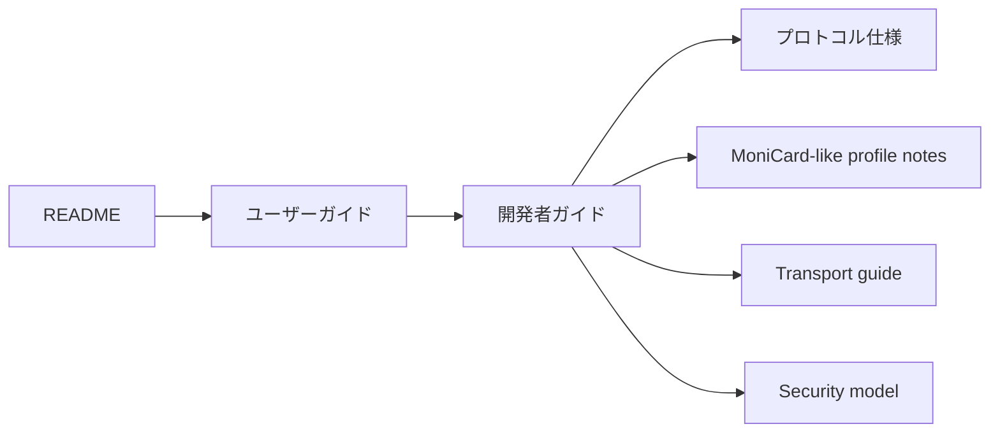
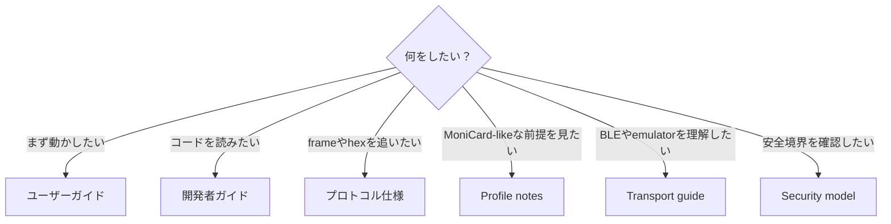

# ドキュメント

MCard-StarterKit は、Bluetooth対応のアニメーションバッジ系デバイスを実験するための、ローカルファーストなクリーンルーム実装スターターキットです。

## 何ができる？

MCard-StarterKitでは、Bluetooth対応アニメーションバッジ系デバイスを想定したローカル実験を一通り行えます。

| Area | できること |
|---|---|
| Profile Editor | category、command、response、transfer limitをJSON profileとして編集 |
| Media Studio | 小さなdisplay向けのstatic mediaを準備 |
| Animation Studio | frame-based animation manifestを作成 |
| Browser-native Media Import | GIF / APNG / WebP / static imageをbrowser APIでimport |
| Media Package Builder | local mediaをpackage JSONへ変換 |
| Profile Frame Lab | CONTROL / FILE / OTA planning frameを作成 |
| Notify Parser Lab | notification hexをnormalized responseへparse |
| JSON Rule Parser Lab | executable pluginなしでJSON rulesによりparser behaviorを追加 |
| Retry Scheduler Lab | ACK/NACK、lost packet、retry stateを検証 |
| Emulator Notify Simulator | hardwareなしでvirtual notificationを生成 |
| Web Bluetooth Transport | 明示確認後にbrowser BLEでframeを書き込む |
| Windows BLE Peripheral Sample | Windows上でlocal GATT peripheral sampleを試す |
| OTA Local Verifier | firmware flashなしでsynthetic local packageをverify |
| Transfer-time Estimator | profile設定とpacket countからtransfer durationを見積もる |
| Workspace Tools | local project stateをexport/import |

## 最初に読む順番

READMEで全体像をつかみ、ユーザーガイドで最初の操作を通し、開発者ガイドでコードの読み順へ進むのがおすすめです。

## ドキュメント一覧

- [ユーザーガイド](USER_GUIDE.md)
- [MoniCardデバイスで試す](MONICARD_HOWTO.md)
- [開発者ガイド](DEVELOPER_GUIDE.md)
- [MoniCard-like profile notes](MONICARD_LIKE_PROFILE_NOTES.md)
- [プロトコル仕様](PROTOCOL_REFERENCE.md)
- [メディアとパッケージ](MEDIA_GUIDE.md)
- [Transport guide](TRANSPORT_GUIDE.md)
- [Hardware planning](HARDWARE.md)
- [Security model](SECURITY.md)

## 目的別の読み方

## 基本方針

- デバイス固有の値はprofileへ置きます。
- 転送処理とparserはローカルファーストにします。
- BLE writeは明示操作かつopt-inにします。
- vendor asset、cloud endpoint、captured app code、firmware blob、private identifierは含めません。
