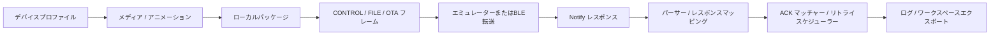
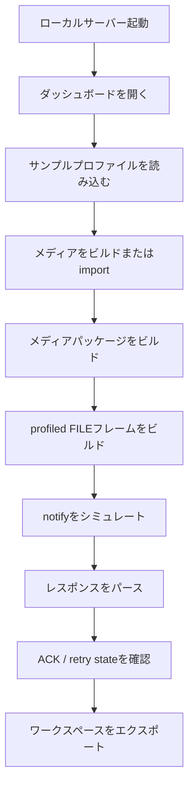
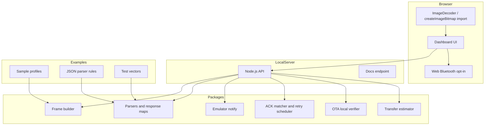

<p align="center">
  
</p>

<h1 align="center">MCard-StarterKit</h1>

<h2 align="center">
  Bluetooth対応アニメーションバッジ実験のための、クリーンルームプレイグラウンド。
</h2>

<p align="center">
  <a href="../LICENSE">
    
  </a>
  <a href="../package.json">
    
  </a>
  <a href="../docs/README.md">
    
  </a>
  <a href="README.md">
    
  </a>
  
  
</p>

<p align="center">
  <strong>プロファイル駆動のメディアパッケージング、フレームビルド、BLEトランスポート実験、パーサー、リトライロジック、アニメーションバッジ系デバイスのローカルエミュレーション。</strong>
</p>

---

## 何ができる？

MCard-StarterKitは、**Electronic Badge、NFC Bluetooth Animated GIF Trendy Toy Keychain系デバイス**を実験するための公開安全なスターターキットです。

vendor cloud serviceやcaptured application codeに依存せず、Bluetoothアニメーションバッジ周りのフルローカルワークフローをビルドおよびテストできます。



### 機能一覧

| 機能 | できること |
|---|---|
| **Profile Editor** | category、command、response、transfer limitをJSON profileとして編集 |
| **Media Studio** | 小さなdisplay向けのstatic mediaを準備 |
| **Animation Studio** | frame-based animation manifestを作成 |
| **Browser-native Media Import** | GIF / APNG / WebP / static imageをbrowser APIでimport |
| **Media Package Builder** | local mediaをpackage JSONへ変換 |
| **Profile Frame Lab** | CONTROL / FILE / OTA planning frameを作成 |
| **FILE Transfer Simulator** | パッケージをフレームに分割してpacket planを確認 |
| **Notify Parser Lab** | notification hexをnormalized responseへparse |
| **JSON Rule Parser Lab** | executable pluginなしでJSON rulesによりparser behaviorを追加 |
| **Retry Scheduler Lab** | ACK/NACK、lost packet、retry stateを検証 |
| **Emulator Notify Simulator** | hardwareなしでvirtual notificationを生成 |
| **Web Bluetooth Transport** | 明示確認後にbrowser BLEでframeを書き込む |
| **Windows BLE Peripheral Sample** | Windows上でlocal GATT peripheral sampleを試す |
| **ESP32 / nRF52 BLE エミュレーター** | 開発ボードをlocal sample BLE peripheralとして使う |
| **OTA Local Verifier** | firmware flashなしでsynthetic local packageをverify |
| **Transfer-time Estimator** | profile設定とpacket countからtransfer durationを見積もる |
| **Workspace Tools** | local project stateをexport/import |

実機で試したい方はこちら → [**MoniCardデバイスで試す**](MONICARD_HOWTO.md) / [English](../docs/MONICARD_HOWTO.md)

## このキットではないもの

MCard-StarterKitは、vendor appのクローン、firmware flasher、cloud client、または製品ハードウェア認証パッケージではありません。

```text
vendor cloudへのアクセスなし
公式アセットなし
captured application codeなし
firmware blobなし
private identifierなし
自動BLE書き込みなし
```

## 安全性の概要

- ローカルファースト。
- vendor cloudへのアクセスなし。
- 公式アセットなし。
- captured application codeなし。
- firmware blobなし。
- BLE書き込みはopt-in。
- OTAツールはローカルでのverificationとplanningのみ。

## 5分クイックスタート

```bash
npm test
PORT=3000 npm start
```

ブラウザで開きます。

```text
http://127.0.0.1:3000
```

ヘルスチェック:

```bash
curl -s http://127.0.0.1:3000/api/health
```

期待値:

```json
{
  "ok": true
}
```

### 最初の成功フロー



### 最小APIチェック

`PORT=3000 npm start` 後、このresponse parserスモークテストが `matched: true` を返すことを確認します。

```bash
curl -s -X POST http://127.0.0.1:3000/api/response/parse \
  -H "Content-Type: application/json" \
  -d '{"group":"file","hex":"04 00 0a 00 09 00 06 00 00 00 01 00 00 00"}'
```

## アーキテクチャ



## リポジトリ構成

```text
apps/
  web/                         ローカルダッシュボード
  windows-ble-peripheral/      Windows GATT peripheral sample

packages/
  frame-builder/               profile-driven frame作成
  notify-parsers/              notification parser registry
  response-mapping/            FILE / OTA response mapping
  control-response-mapping/    CONTROL response mapping
  retry-scheduler/             retry state machine
  ack-matcher/                 per-packet ACK matching
  transport/                   transport abstraction
  transport-adapters/          log adapters
  emulator-notify/             virtual notify generator
  ota-local-verifier/          synthetic package verifier
  media-tools/                 media推定とframe planning
  transfer-estimator/          transfer-time推定
  json-rule-parser/            safe JSON parser rules

examples/
  esp32-ble-peripheral/        ESP32 hardware BLE emulator
  nrf52-ble-peripheral/        nRF52840 hardware BLE emulator
  profiles/                    sample profiles
  plugins/                     JSON rule parser examples
  responses/                   response fixtures
  test-vectors/                protocol vectors

docs/
  英語ドキュメント

docs-ja/
  日本語ドキュメント
```

## ドキュメント

| ドキュメント | 内容 |
|---|---|
| [ユーザーガイド](USER_GUIDE.md) | パネル名・操作・期待値つきのdashboard初回ワークフロー |
| [MoniCardデバイスで試す](MONICARD_HOWTO.md) | 実機へのメディア転送、BLE接続、パース、リトライの手順 |
| [開発者ガイド](DEVELOPER_GUIDE.md) | コードの読み順、モジュール責務、変更チェックリスト |
| [MoniCard-like profile notes](MONICARD_LIKE_PROFILE_NOTES.md) | 公開安全なcompatibility modelと実装マッピング |
| [プロトコル仕様](PROTOCOL_REFERENCE.md) | バイトレベルのframe形状、hex例、offsetテーブル、parse結果 |
| [メディアとパッケージ](MEDIA_GUIDE.md) | browser-native import、package生成、estimatorメモ |
| [Transport guide](TRANSPORT_GUIDE.md) | Emulator、Web Bluetooth、Windows peripheral、ログ、retry flow |
| [Hardware planning](HARDWARE.md) | BOM、bring-up順序、ハードウェア注意事項 |
| [Security model](SECURITY.md) | クリーンルーム境界、threat model、BLE安全ルール |

英語ドキュメントは [`docs/`](../docs/README.md) にあります。

## Windowsエミュレーターリリース

`v*` タグをpushするとWindowsエミュレーターリリースワークフローが実行され、マッチするGitHub Releaseにself-contained x64パッケージが添付されます。

```text
mcardkit-windows-emulator-<tag>-win-x64.zip
SHA256SUMS-windows
```

パッケージには明示同意ランチャー、チェックサム、ローカルGATT peripheral実行ファイルが含まれます。非公式なローカルテスト用ソフトウェアであり、firmwareのflashやvendor serviceへの接続は行いません。

## ハードウェアBLEエミュレータークイックスタート

ESP32とnRF52のexampleは `MCardKit-Emu` としてアドバタイズし、separate neutralなwrite/notifyキャラクタリスティックを持ちます。dashboardから明示的にwriteした後、deterministic CONTROL responseとFILE/OTA planning ACKを返します。

```bash
pio run -d examples/esp32-ble-peripheral
# または
pio run -d examples/nrf52-ble-peripheral
```

アップロード、シリアルモニター、dashboard接続の手順は各example READMEと[Transport guide](TRANSPORT_GUIDE.md)を参照してください。これらのexampleは公開安全なcompatibility emulatorであり、公式firmwareではありません。他のデバイスへのfirmware flashは行いません。

### ビルド済みエミュレーターパッケージ

`v` で始まるタグをpushすると `.github/workflows/hardware-emulator-release.yml` が実行されます。ワークフローは両ボードをビルドし、以下のパッケージをGitHub Releaseに添付します。

```text
mcardkit-emu-esp32-<tag>.zip
mcardkit-emu-nrf52-<tag>.zip
SHA256SUMS
```

各ZIPには生成されたエミュレーターバイナリ、マッチする公開ソース/設定、ボード固有のflashingメモ、内部チェックサムが含まれます。手動ワークフロー実行ではダウンロード可能なActions artifactが作成されますが、GitHub Releaseは作成されません。

## クリーンルームポリシー

追加してはいけないもの:

- vendor endpoint、
- 公式アセット、
- captured application code、
- firmware blob、
- private identifier、
- HARファイル、
- extracted package artifact。

デバイス固有の動作はprofile、JSON rules、fixture、またはドキュメントへ置いてください。汎用パッケージはprofile-drivenに保ちます。

## 開発

```bash
npm test
npm start
```

Pull Requestを開く前に [`CONTRIBUTING.md`](../CONTRIBUTING.md) を参照してください。

## ライセンス

MIT。[`LICENSE`](../LICENSE) を参照してください。

---

<p align="center">
  ローカル実験、小さな画面、パケットパズル、そしてプラスチックの矩形を意図的に光らせる特別な喜びのために作られました。
</p>
