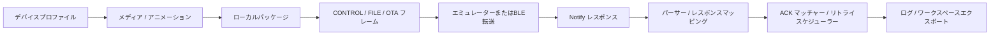
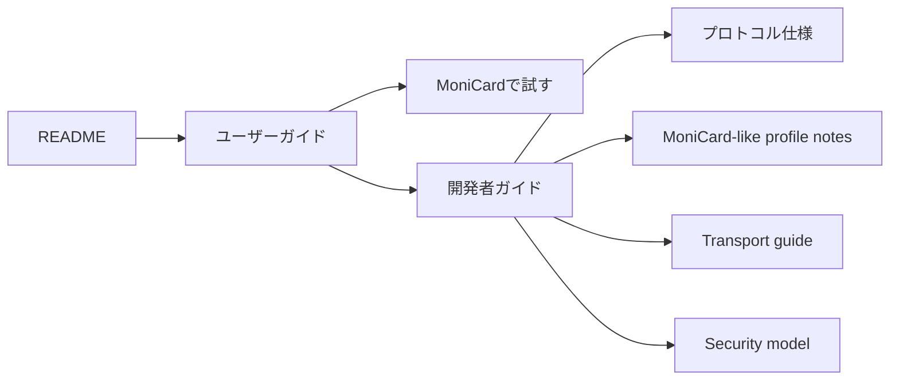
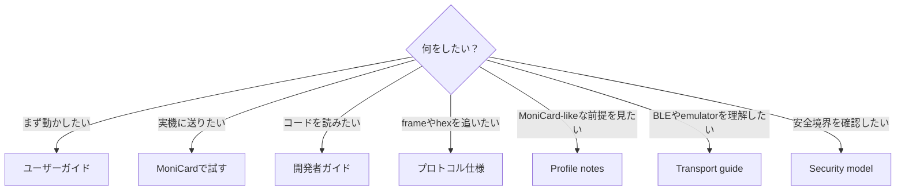

  

<h1 align="center">MCard-StarterKit — ドキュメント</h1>

  
  
  
  

  <strong>Bluetooth対応アニメーションバッジ系デバイスを実験するための、ローカルファーストなクリーンルーム実装スターターキットです。</strong>

---

## 何ができる？

### 機能一覧

| 機能 | できること |
|---|---|
| **Profile Editor** | category、command、response、transfer limitをJSON profileとして編集 |
| **Media Studio** | 小さなdisplay向けのstatic mediaを準備 |
| **Animation Studio** | frame-based animation manifestを作成 |
| **Browser-native Media Import** | GIF / APNG / WebP / static imageをbrowser APIでimport |
| **Media Package Builder** | local mediaをpackage JSONへ変換 |
| **Profile Frame Lab** | CONTROL / FILE / OTA planning frameを作成 |
| **FILE Transfer Simulator** | パッケージをフレームに分割してpacket planを確認 |
| **Notify Parser Lab** | notification hexをnormalized responseへparse |
| **JSON Rule Parser Lab** | executable pluginなしでJSON rulesによりparser behaviorを追加 |
| **Retry Scheduler Lab** | ACK/NACK、lost packet、retry stateを検証 |
| **Emulator Notify Simulator** | hardwareなしでvirtual notificationを生成 |
| **Web Bluetooth Transport** | 明示確認後にbrowser BLEでframeを書き込む |
| **Windows BLE Peripheral Sample** | Windows上でlocal GATT peripheral sampleを試す |
| **ESP32 / nRF52 BLE エミュレーター** | 開発ボードをlocal sample BLE peripheralとして使う |
| **OTA Local Verifier** | firmware flashなしでsynthetic local packageをverify |
| **Transfer-time Estimator** | profile設定とpacket countからtransfer durationを見積もる |
| **Workspace Tools** | local project stateをexport/import |

実機で試したい方はこちら → [**MoniCardデバイスで試す**](MONICARD_HOWTO.md) / [English](../docs/MONICARD_HOWTO.md)

---

## 最初に読む順番

READMEで全体像をつかみ、ユーザーガイドで最初の操作を通し、開発者ガイドでコードの読み順へ進むのがおすすめです。

## ドキュメント一覧

- [ユーザーガイド](USER_GUIDE.md)
- [MoniCardデバイスで試す](MONICARD_HOWTO.md)
- [開発者ガイド](DEVELOPER_GUIDE.md)
- [MoniCard-like profile notes](MONICARD_LIKE_PROFILE_NOTES.md)
- [プロトコル仕様](PROTOCOL_REFERENCE.md)
- [メディアとパッケージ](MEDIA_GUIDE.md)
- [Transport guide](TRANSPORT_GUIDE.md)
- [Hardware planning](HARDWARE.md)
- [Security model](SECURITY.md)

## 目的別の読み方

## 基本方針

- デバイス固有の値はprofileへ置きます。
- 転送処理とparserはローカルファーストにします。
- BLE writeは明示操作かつopt-inにします。
- vendor asset、cloud endpoint、captured app code、firmware blob、private identifierは含めません。
