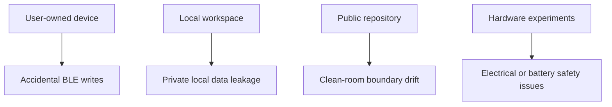

# Security model

この文書はclean-room境界とlocal-first security modelを説明します。

## Defaults

- local-first operation
- vendor cloud callsなし
- official assetsなし
- captured application codeなし
- firmware blobsなし
- BLE write前に明示確認
- OTA toolingはlocal verificationとplanningのみ

## Clean-room contribution rules

追加禁止。

- vendor cloud endpoints
- official assets
- captured application code
- firmware blobs
- private IDs or tokens
- HAR files or extracted package artifacts

## BLE caution

BLE writeはuser-owned deviceに影響しうる操作です。transportはopt-inかつprofile-drivenに保ってください。

## Threat model

## Protected

- User-owned device safety
- Local workspace data
- Clean-room repository boundary
- Accidental BLE write prevention

## Out of scope

- Production security certification
- Firmware authenticity verification
- Vendor cloud compatibility
- Hardware electrical safety certification
