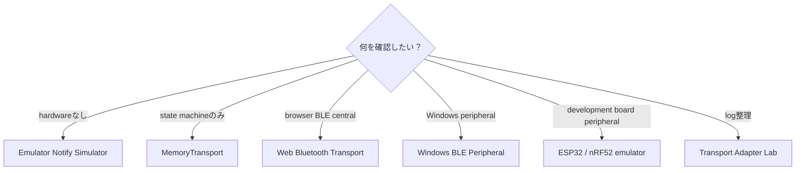
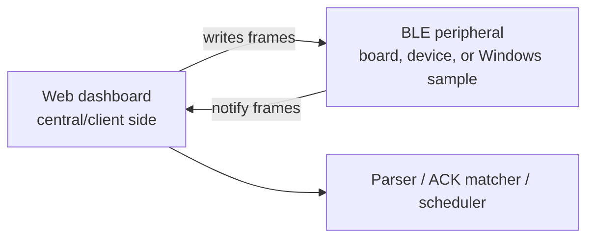

# Transport guide

この文書は、Web Bluetooth、emulator、retry、Windows peripheralの使い分けを説明します。

## どのtransportを使うべきか

| Situation | Use |
|---|---|
| hardwareなしでparserとretryをtestしたい | Emulator Notify Simulator |
| transfer state machineだけtestしたい | MemoryTransport |
| browser BLE write pathをtestしたい | Web Bluetooth Transport |
| Windowsでperipheral behaviorをtestしたい | Windows BLE Peripheral |
| development boardをphysical peripheralとしてtestしたい | ESP32 / nRF52 BLE emulator |
| test後のlogを正規化したい | Transport Adapter Lab |
| test前にtransfer durationを見積もりたい | Transfer-time estimator |



## Transport types

このprojectには以下があります。

- Web Bluetooth opt-in transport
- deterministic local testing用memory transport
- emulator notification simulation
- Windows BLE peripheral source sample
- ESP32 / nRF52 hardware BLE peripheral example
- transport log adapters

## Web Bluetooth

Web Bluetooth writeには、明示的なユーザー操作と安全確認が必要です。

## Emulator notify simulator

simulatorはCONTROL / FILE / OTA request frameをactive profileに基づいてvirtual notificationへ変換します。hardwareなしでlocal testできます。

## Retry scheduler

schedulerはparsed notificationとretry behaviorをつなぎます。ACKはpacket index単位でmatchingできます。

## Windows BLE peripheral sample

Windows sampleはlocal GATT serviceをadvertiseし、frame writeに対してvirtual notificationを返します。起動には明示的なlocal-test flagが必要です。

Windows + .NET 8 + Windows SDK + peripheral role対応Bluetooth adapter上でbuild/testしてください。

### Prebuilt Windows package

`v*` tagをpushすると `.github/workflows/windows-emulator-release.yml` がWindows
GitHub Actions runner上で動作し、self-contained x64 ZIPを対応するGitHub Release
へ公開します。

```text
mcardkit-windows-emulator-<tag>-win-x64.zip
SHA256SUMS-windows
```

ZIPを展開して `.\run-local-test-peripheral.ps1` を実行します。launcherは必須の
local-test consent flagとneutral sample service/write/notify UUIDを渡します。
workflowを手動実行した場合はActions artifactだけを生成し、Releaseは公開しません。

packageはWindows 10 2004以降向けのunofficial local test softwareです。peripheral
role対応のBluetooth adapterとdriverが必要です。firmware flashingやvendor service
への接続は行いません。

## ESP32 / nRF52 hardware BLE emulator

`examples/esp32-ble-peripheral/` と `examples/nrf52-ble-peripheral/` のexample
は、development boardを `MCardKit-Emu` という名前のperipheralとしてadvertise
します。

neutral sample identifierは次のとおりです。

```text
Service: 7a2f0000-2b3c-4d5e-8f90-000000000000
Write:   7a2f0002-2b3c-4d5e-8f90-000000000000
Notify:  7a2f0003-2b3c-4d5e-8f90-000000000000
```

PlatformIOでbuildします。

```bash
pio run -d examples/esp32-ble-peripheral
pio run -d examples/nrf52-ble-peripheral
```

ESP32へのuploadとserial monitorの例です。

```bash
pio run -d examples/esp32-ble-peripheral -t upload
pio device monitor -b 115200
```

nRF52840 DKではupload commandのdirectoryをnRF52 exampleへ変更します。hostに
よってport名が異なるため、必要ならPlatformIOの `--upload-port` または
`--port` optionを指定します。

dashboardからの接続は明示的なopt-inです。

1. local dashboardを起動し、Chromium-based browserで開きます。
2. Web Bluetooth Transportへservice/write/notify UUIDを入力します。
3. own-device authorization checkboxを確認します。
4. Connectを選び、`MCardKit-Emu` を選択します。
5. notificationを有効化します。
6. 生成したCONTROL / FILE / OTA planning frameを明示的にwriteします。

version query時のserial log例:

```text
RX 1F 00 02 00 14 00
TX 1F 00 07 00 15 00 30 2E 31 2E 30
```

既知のFILE / OTA requestにはstatus zeroのdeterministic ACKを返します。不正または
未知のframeはserial warningだけを出し、notifyしません。OTA処理はplanning /
verification専用であり、実デバイスへのfirmware flashingは行いません。

### GitHub Release package

`v*` に一致するtagをpushするとhardware emulator release workflowが起動します。

```bash
git tag v0.2.0
git push origin v0.2.0
```

両方のPlatformIO buildが成功すると、そのtagのGitHub Releaseを作成または更新し、
ESP32 / nRF52 ZIP packageと `SHA256SUMS` をuploadします。各packageには生成binary、
対応するpublic example source/config、flashing note、fileごとのchecksumが含まれます。

これらはrepositoryのpublic-safe emulatorから生成したunofficial buildです。vendor
firmwareではなく、documented development-board target以外へwriteしてはいけません。
workflowを手動実行した場合はtemporary Actions artifactだけを生成し、Releaseは公開
しません。

## Central and peripheral roles



Web dashboardはcentral/client側です。Windows BLE peripheral sampleや実デバイスはperipheral/server側です。

## Web Bluetooth requirements

- Chromium-based browserを推奨します。
- secure contextが必要です。`localhost` は利用できます。
- device selectionはuser gestureから開始する必要があります。
- userがdeviceを選択する必要があります。
- service UUIDとcharacteristic UUIDはlocal settingsまたはactive profileに合わせます。
- iOS Safariでは、このworkflowのsupportが限定的または利用できない場合があります。
