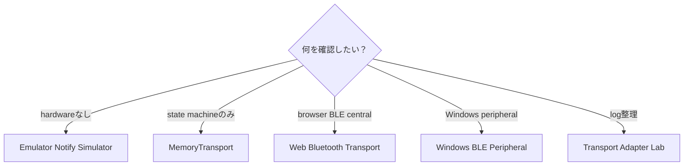
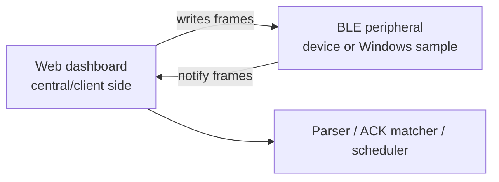

# Transport guide

この文書は、Web Bluetooth、emulator、retry、Windows peripheralの使い分けを説明します。

## どのtransportを使うべきか

| Situation | Use |
|---|---|
| hardwareなしでparserとretryをtestしたい | Emulator Notify Simulator |
| transfer state machineだけtestしたい | MemoryTransport |
| browser BLE write pathをtestしたい | Web Bluetooth Transport |
| Windowsでperipheral behaviorをtestしたい | Windows BLE Peripheral |
| test後のlogを正規化したい | Transport Adapter Lab |
| test前にtransfer durationを見積もりたい | Transfer-time estimator |



## Transport types

このprojectには以下があります。

- Web Bluetooth opt-in transport
- deterministic local testing用memory transport
- emulator notification simulation
- Windows BLE peripheral source sample
- transport log adapters

## Web Bluetooth

Web Bluetooth writeには、明示的なユーザー操作と安全確認が必要です。

## Emulator notify simulator

simulatorはCONTROL / FILE / OTA request frameをactive profileに基づいてvirtual notificationへ変換します。hardwareなしでlocal testできます。

## Retry scheduler

schedulerはparsed notificationとretry behaviorをつなぎます。ACKはpacket index単位でmatchingできます。

## Windows BLE peripheral sample

Windows sampleはlocal GATT serviceをadvertiseし、frame writeに対してvirtual notificationを返します。起動には明示的なlocal-test flagが必要です。

Windows + .NET 8 + Windows SDK + peripheral role対応Bluetooth adapter上でbuild/testしてください。

### Prebuilt Windows package

`v*` tagをpushすると `.github/workflows/windows-emulator-release.yml` がWindows
GitHub Actions runner上で動作し、self-contained x64 ZIPを対応するGitHub Release
へ公開します。

```text
mcardkit-windows-emulator-<tag>-win-x64.zip
SHA256SUMS-windows
```

ZIPを展開して `.\run-local-test-peripheral.ps1` を実行します。launcherは必須の
local-test consent flagとneutral sample service/write/notify UUIDを渡します。
workflowを手動実行した場合はActions artifactだけを生成し、Releaseは公開しません。

packageはWindows 10 2004以降向けのunofficial local test softwareです。peripheral
role対応のBluetooth adapterとdriverが必要です。firmware flashingやvendor service
への接続は行いません。

## Central and peripheral roles



Web dashboardはcentral/client側です。Windows BLE peripheral sampleや実デバイスはperipheral/server側です。

## Web Bluetooth requirements

- Chromium-based browserを推奨します。
- secure contextが必要です。`localhost` は利用できます。
- device selectionはuser gestureから開始する必要があります。
- userがdeviceを選択する必要があります。
- service UUIDとcharacteristic UUIDはlocal settingsまたはactive profileに合わせます。
- iOS Safariでは、このworkflowのsupportが限定的または利用できない場合があります。
