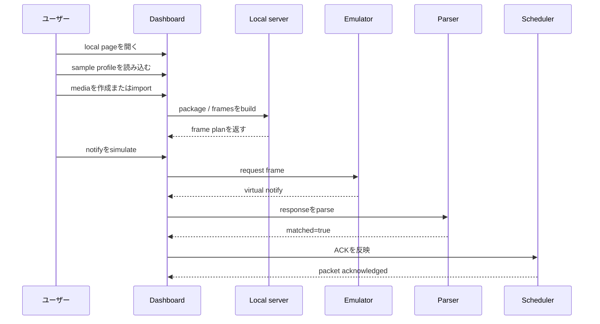
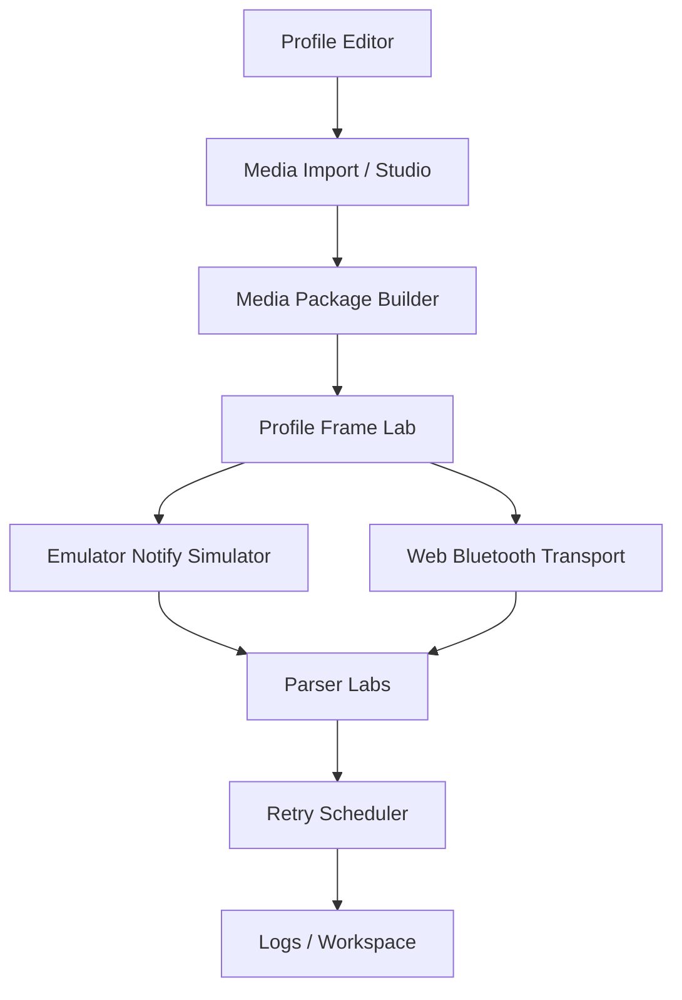

# ユーザーガイド

このガイドでは、初めて触る開発者がdashboardで最初の成功体験まで進む手順を説明します。

## Dashboardを起動する

```bash
PORT=3000 npm start
```

ブラウザで開きます。

```text
http://127.0.0.1:3000
```

## 最初の成功フロー



この図は、ローカルだけで「profileからframeを作り、仮想通知を返し、parserとretryまで確認する」流れを示しています。

## 手順

### 1. serverが動いているか確認する

```bash
curl -s http://127.0.0.1:3000/api/health
```

期待値。

```json
{
  "ok": true
}
```

### 2. dashboardを開く

見るpanel。

```text
Profile Editor
```

期待値。

```text
cloud accountやexternal serviceを要求されず、dashboardが表示される。
```

### 3. sample profileを読み込む

Panel。

```text
Profile Editor
```

Action。

```text
examples/profiles/monicard-like.sample.json を読み込む
```

期待値。

```text
categories
fileCommands
controlCommands
otaCommands
transfer
```

これらがprofile editorに表示されます。

### 4. mediaを作る、またはimportする

| 目的 | Panel | Action |
|---|---|---|
| static image | Media Studio | 240x320 imageを読み込む、または作る |
| animation | Animation Studio | 短いframe animationを作る |
| GIF/APNG/WebP | Browser-native Media Import | fileを選んで Import native media |

期待値。

```text
local media source または animation source が利用可能になる。
```

### 5. media packageを作る

Panel。

```text
Media Package Builder
```

Action。

```text
Build media package
```

期待値。

```text
package JSONが出力される。
```

### 6. profiled FILE framesを作る

Panel。

```text
FILE Transfer Simulator または Profile Frame Lab
```

Action。

```text
Build profiled frames
```

期待値。

```json
{
  "totalPackets": 1
}
```

`totalPackets` が1以上なら、packageがtransfer framesへ変換されています。

### 7. notificationをsimulateする

Panel。

```text
Emulator Notify Simulator
```

Action。

```text
request frameを貼り付けて Simulate notify
```

例。

```text
1f 00 02 00 14 00
```

期待値。

```text
virtual notify frameが生成される。
```

### 8. responseをparseする

Panel。

```text
CONTROL Response Parser
FILE / OTA Response Parser
JSON Rule Parser Lab
```

Action。

```text
notify hexを貼り付けてparse
```

期待値。

```json
{
  "matched": true
}
```

### 9. ACKを反映する

Panel。

```text
Retry Scheduler Lab
```

Action。

```text
framesをloadし、send next後にparsed notificationを反映
```

期待値。

```text
packet stateがackになる、またはretry stateが更新される。
```

### 10. workspaceをexportする

Panel。

```text
Workspace
```

Action。

```text
Export workspace
```

期待値。

```text
local workspace JSONがdownloadまたはcopyされる。
```

## Dashboard map



上から下へ読みます。profileとmedia packageからframeを作り、frameからnotificationを得て、parserとschedulerへ進みます。

## Troubleshooting

| 症状 | 確認 |
|---|---|
| dashboardが開かない | `PORT=3000 npm start` が動いているか |
| `/api/health` が失敗する | server terminalのerror |
| profileが出ない | `examples/profiles/` が存在するか |
| frame planが0 packet | packageを先にbuildしたか |
| parserが `matched: false` | category、command、active profileのresponse map |
| Web Bluetoothが接続できない | Chromium系browser、user gesture、UUID設定 |

## Safety notes

OTA機能は、local package verificationとframe planning用です。firmware flashは行いません。

Web Bluetooth writeには、明示的なユーザー操作と確認が必要です。
