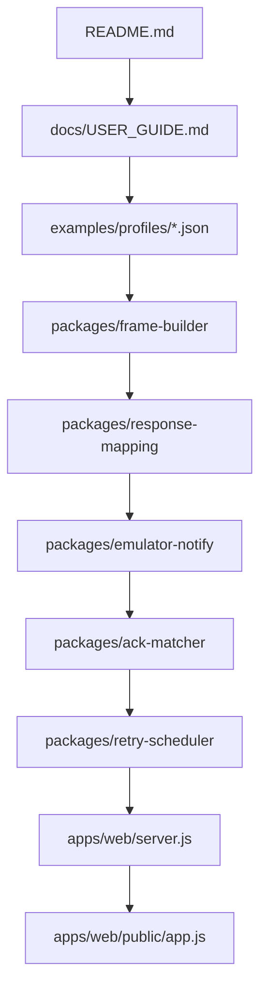
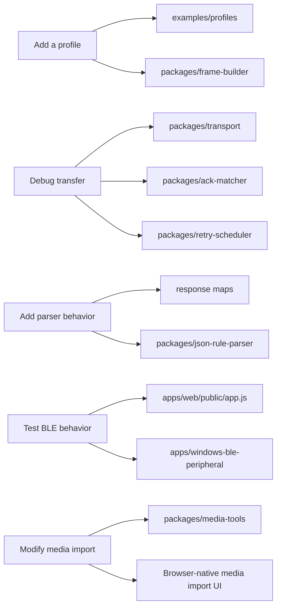
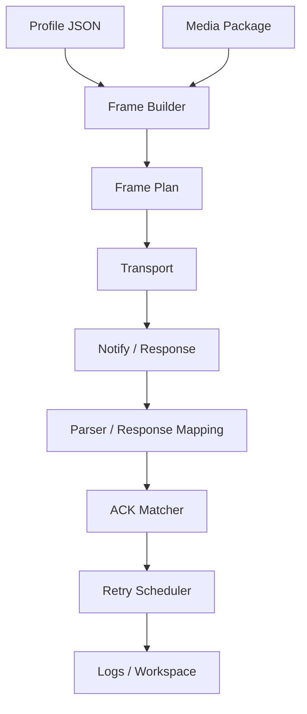

# Developer guide

This guide is for contributors who want to understand MCard-StarterKit without reading every source file first.

## Suggested reading order



Read this diagram top to bottom. Start with the dashboard workflow, then follow one sample profile through frame creation, response parsing, ACK matching, and retry state.

## Purpose-based entry points



Use this as a routing table. Pick the branch closest to your change, then open the listed package or example.

## System overview



Profile and media become a frame plan. Transports produce notifications. Parsers normalize them. The matcher and scheduler update transfer state.

## Design goals

MCard-StarterKit is built around four rules:

1. **Profile-driven behavior**  
   Device-specific values belong in JSON profiles, not hard-coded core modules.

2. **Local-first execution**  
   The dashboard, frame builders, parsers, emulators, and verifiers run locally.

3. **Explicit transport actions**  
   BLE operations must be opt-in. No automatic scanning or writing should happen on page load.

4. **Clean-room boundaries**  
   Do not include vendor cloud endpoints, official assets, captured app code, firmware blobs, private identifiers, or extracted package artifacts.

## Repository map

```text
apps/
  web/
    server.js                 Local Node.js dashboard server
    public/
      index.html              Dashboard UI
      app.js                  Browser-side workflow logic

  windows-ble-peripheral/
    MCardBlePeripheral/       Windows GATT peripheral source sample
    scripts/                  PowerShell build/run helpers

packages/
  frame-builder/              Profile-driven frame creation
  notify-parsers/             Notification parser registry
  response-mapping/           FILE / OTA response mapping
  control-response-mapping/   CONTROL response mapping
  retry-scheduler/            ACK/NACK retry state machine
  ack-matcher/                Per-packet ACK matching
  transport/                  Transport abstraction and memory transport
  transport-adapters/         Log normalization adapters
  emulator-notify/            Virtual notify generator
  ota-local-verifier/         Synthetic package builder/verifier
  media-tools/                Size estimates and frame optimization planning
  transfer-estimator/         Profile-specific transfer-time estimates
  json-rule-parser/           Safe JSON parser rules

examples/
  profiles/                   Sample device profiles
  plugins/                    JSON rule parser examples
  test-vectors/               Protocol-level examples
```

## Useful examples

| File | Why it matters |
|---|---|
| `examples/profiles/monicard-like.sample.json` | Sample profile with categories, commands, response maps, and transfer settings |
| `examples/test-vectors/protocol-vectors.json` | Protocol examples for frame and parser behavior |
| `examples/plugins/monicard-like-file-ack.rules.json` | JSON rule parser example |
| `examples/responses/monicard-like-file-data-response.hex` | FILE response fixture |
| `examples/responses/monicard-like-ota-data-response.hex` | OTA response fixture |
| `examples/emulator/notify-scenario.json` | Emulator notify scenario |
| `examples/workspace/minimal-workspace.json` | Minimal workspace shape |

## Core data model

### Profile

A profile is the central configuration object. It can define:

```text
id
title
categories
frameModes
controlCommands
fileCommands
otaCommands
controlResponses
fileResponses
otaResponses
transfer
ota
media
notifyParsers
```

The core should treat profiles as data. Adding another badge-like target should normally mean adding a profile, not rewriting frame code.

### Media package

A media package is a local JSON object that describes static or animated media. It is not a firmware image.

### Frame plan

A frame plan is a local transfer plan containing packet size, total packets, payload sizes, and generated frame hex.

### Parsed response

Response parsers return a normalized structure:

```text
matched
group
type
command
commandName
requestCommandName
status
value
dataHex
rawHex
message
```

Schedulers and ACK matchers should consume this normalized shape rather than parser-specific internals.

## Module responsibilities

| Module | Responsibility |
|---|---|
| `packages/frame-builder` | Convert profile data and bytes into frame bytes |
| `packages/notify-parsers` | Parse raw notification shapes |
| `packages/response-mapping` | Map FILE / OTA response frames |
| `packages/control-response-mapping` | Map CONTROL response frames |
| `packages/retry-scheduler` | Track retry state |
| `packages/ack-matcher` | Match parsed ACK/NACK to an in-flight packet |
| `packages/transport` | Define and test transport behavior |
| `packages/emulator-notify` | Generate virtual notifications |
| `packages/ota-local-verifier` | Build and verify synthetic local packages |
| `packages/json-rule-parser` | Parse notifications using safe JSON rules |

## Local server APIs

Representative endpoints:

```text
GET  /api/health
GET  /api/docs
GET  /api/profiles
GET  /api/profile?path=...

POST /api/file/frames
POST /api/file/frames-profiled
POST /api/frame/build-profiled
POST /api/ota/frames-profiled

POST /api/notify/parse
POST /api/notify/parse-and-schedule
POST /api/response/parse
POST /api/control/parse-response
POST /api/json-rules/parse

POST /api/retry/run
POST /api/emulator/notify
POST /api/ota/build-local
POST /api/ota/verify-local
POST /api/transfer/estimate
POST /api/transport/adapt-log
POST /api/workspace/migrate
```

Server endpoints should stay local and deterministic. Avoid network calls.

## Change checklists

### Add a new profile

- Add `examples/profiles/<name>.sample.json`.
- Define `categories`.
- Define `frameModes`.
- Define command maps.
- Define response maps.
- Define transfer limits.
- Add at least one fixture or test vector.
- Run `npm test`.

### Add parser behavior

- Try profile response maps first.
- Try JSON rule parser second.
- Add executable parser code only if needed.
- Add fixture hex.
- Add parser tests.
- Run `npm test`.

### Add frame behavior

- Keep profile-specific constants out of core modules.
- Add sample profile data.
- Add protocol vector.
- Add frame builder test.
- Update `docs/PROTOCOL_REFERENCE.md` if public behavior changes.

### Change media import

- Document browser API assumptions.
- Add size or memory caveats.
- Add or update media tools tests.
- Confirm package estimator still works.

## Public contribution checklist

Before opening a pull request:

```text
npm test
```

Then confirm:

- Docs were updated if public behavior changed.
- New protocol behavior has a test or fixture.
- Device-specific constants are in profiles.
- JSON rules are preferred over executable parser code.
- No vendor endpoints, official assets, captured app code, firmware blobs, private identifiers, or extracted artifacts were added.
