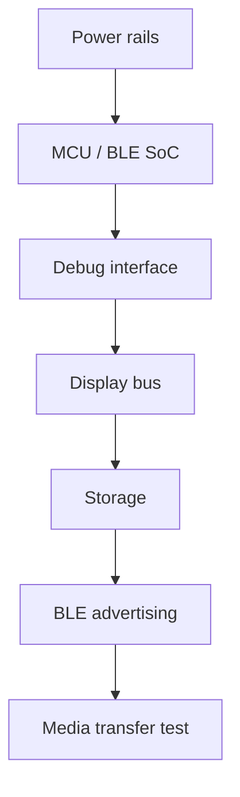

# Hardware planning

Hardware files live under `hardware/`.

## Included planning files

- `hardware/bom/bom-template.csv`
- `hardware/notes/bringup-checklist.md`
- `hardware/pcb/reference-block-diagram.md`
- `hardware/enclosure/enclosure-notes.md`

## Hardware BLE emulator examples

Two PlatformIO examples provide a physical peripheral/server for local
dashboard transport tests:

- `examples/esp32-ble-peripheral/` for an `esp32dev`-compatible board
- `examples/nrf52-ble-peripheral/` for an nRF52840 DK using the
  `nrf52840_dk_adafruit` PlatformIO board target

Build commands:

```bash
pio run -d examples/esp32-ble-peripheral
pio run -d examples/nrf52-ble-peripheral
```

Each example README includes upload, serial monitor, and dashboard connection
steps. Both advertise only the neutral sample service and separate write/notify
characteristic UUIDs. A board sends deterministic notifications only after a
central connects, enables notifications, and explicitly writes a valid frame.

These are public-safe, unofficial compatibility emulators. OTA-category
support returns sample planning ACKs and never flashes firmware to a real
device.

## Prebuilt release packages

The GitHub Actions workflow
`.github/workflows/hardware-emulator-release.yml` builds both board examples.
A `v*` tag publishes board-specific ZIP files and `SHA256SUMS` to the matching
GitHub Release. Manual workflow runs create temporary Actions artifacts only.

Release packages contain binaries generated from the tagged public source,
matching configuration/source files, checksums, and target-specific flashing
notes. They do not contain vendor firmware or firmware for another device.

## Reminder

These files are planning aids. They are not certified schematics, production drawings, or safety approvals.


## Recommended bring-up order



## Cautions

- Start with current-limited power.
- Validate charger behavior before installing a battery.
- Keep the antenna zone clear of metal and dense ground structures.
- Treat display current and backlight thermal behavior as design constraints.
- Do not treat these planning files as certification evidence.
