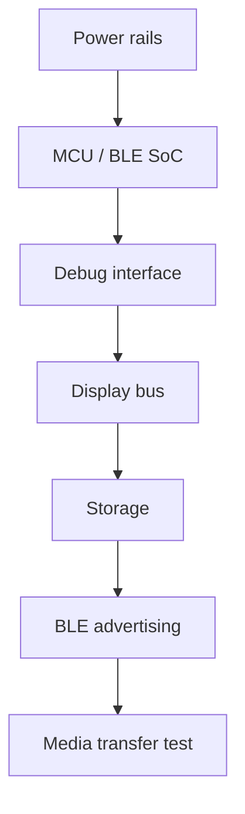

# Hardware planning

Hardware files live under `hardware/`.

## Included planning files

- `hardware/bom/bom-template.csv`
- `hardware/notes/bringup-checklist.md`
- `hardware/pcb/reference-block-diagram.md`
- `hardware/enclosure/enclosure-notes.md`

## Reminder

These files are planning aids. They are not certified schematics, production drawings, or safety approvals.

## Recommended bring-up order

## Cautions

- Start with current-limited power.
- Validate charger behavior before installing a battery.
- Keep the antenna zone clear of metal and dense ground structures.
- Treat display current and backlight thermal behavior as design constraints.
- Do not treat these planning files as certification evidence.
