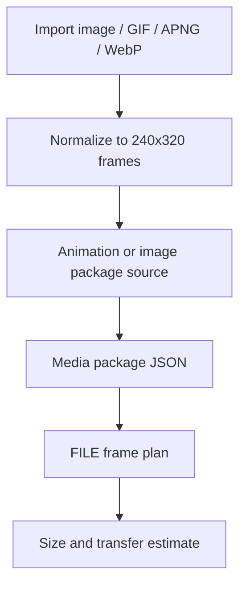

# Media and package guide

## Static media

Static images are normalized for a 240x320 display-oriented workflow.

## Animated media

Animations are represented as frame manifests with per-frame duration.

Browser-native import uses:

1. `ImageDecoder` when available,
2. `createImageBitmap` as a static-frame fallback.

No third-party decoder is bundled by default.

## Package estimation

The dashboard can estimate:

- approximate payload bytes,
- frame count,
- transfer bytes,
- profile size warnings.

## OTA local verifier

Synthetic `.mcot` packages can be built and verified locally. The verifier checks structure, image table data, hashes, and CRC values.

The verifier is not a firmware flashing tool.

## Media pipeline

## Browser-native import limits

- GIF animation support depends on `ImageDecoder`.
- APNG support varies by browser.
- Animated WebP support varies by browser.
- Fallback mode may decode only a static frame.
- Imported frames are normalized to PNG data URLs.
- Large animations may create memory pressure.
