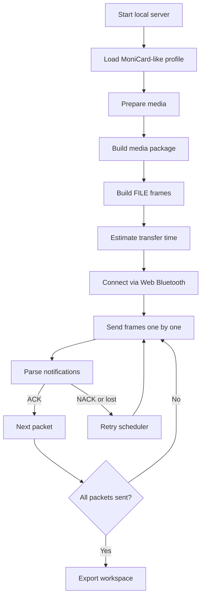

# How to try with a MoniCard device

This guide explains how to use MCard-StarterKit to send media frames to a physical MoniCard-like BLE display badge.

It covers the path from a blank local server to a parsed notification from a real device. If you have no hardware, stop at step 6 and use the Emulator Notify Simulator instead — the rest of the flow is identical.

## Prerequisites

| Requirement | Notes |
|---|---|
| Node.js 18 or later | `node --version` to confirm |
| Chromium-based browser | Chrome or Edge — Web Bluetooth requires it |
| Physical MoniCard-like device | Charged and within BLE range |
| No cloud account needed | Everything runs locally |

## Safety notes

- This kit is clean-room only. No vendor cloud endpoints, no captured app code, no firmware blobs.
- Web Bluetooth writes are always opt-in. The browser prompts you to pick a device and you must approve each connection.
- OTA features are local planning and verification only. Nothing in this kit flashes firmware to another device.

See [Security model](SECURITY.md) for the full boundary list.

## Step 1: Install and start the server

```bash
npm install
PORT=3000 npm start
```

Confirm it is alive:

```bash
curl -s http://127.0.0.1:3000/api/health
```

Expected:

```json
{ "ok": true }
```

Then open the dashboard:

```text
http://127.0.0.1:3000
```

## Step 2: Load the MoniCard-like profile

Panel: **Profile Editor**

Action:
```text
Load  →  examples/profiles/monicard-like.sample.json
```

Expected fields after loading:

```text
categories
fileCommands
controlCommands
otaCommands
transfer
```

This profile configures frame shapes, category byte values, command codes, and packet sizing. All device-specific values are read from this file at runtime — no core code needs editing.

If your device uses different UUIDs or command codes, duplicate the sample file and edit it rather than modifying the original.

## Step 3: Prepare media

Choose a panel based on what you want to send:

| Goal | Panel | Action |
|---|---|---|
| Static image (PNG/JPEG) | Media Studio | Load or draw a 240×320 image |
| Short animation | Animation Studio | Build a frame animation manifest |
| GIF / APNG / WebP | Browser-native Media Import | Choose file → Import native media |

Expected result: a local media or animation source is available in the dashboard.

The sample profile targets a 240×320 portrait display. Other sizes work if your profile declares different limits.

## Step 4: Build a media package

Panel: **Media Package Builder**

Action:
```text
Build media package
```

Expected output: Package JSON appears in the package output area. Note the `byteLength` and `crc` fields — they appear in the FILE send-start frame.

## Step 5: Build FILE frames

Panel: **Profile Frame Lab** or **FILE Transfer Simulator**

Action:
```text
Build profiled frames
```

Expected output:

```json
{ "totalPackets": 1 }
```

Any non-zero `totalPackets` means the package was split into transfer-ready frames. The frame plan shows each packet with byte content and index.

## Step 6: Estimate transfer time (optional)

Panel: **Transfer-time Estimator**

Input the frame plan or packet count. The estimator uses the active profile's MTU and write-rate assumptions to give an approximate duration.

Treat the estimate as approximate. Actual timing depends on connection interval, ACK delay, and browser BLE behavior.

## Step 7: Connect to the device via Web Bluetooth

> Web Bluetooth requires a Chromium-based browser (Chrome or Edge). Safari and Firefox do not support it.

Panel: **Web Bluetooth Transport**

Steps:

1. Turn on your MoniCard-like device.
2. Keep it within 2–3 m of your computer.
3. Click **Connect**.
4. A browser device-picker dialog opens. Select your device from the list.
5. Click **Pair**.

Expected serial output (if you have a serial monitor open):

```text
BLE connected
```

The dashboard connects as a BLE central. Your device acts as the peripheral/server.

The sample profile uses these neutral UUIDs:

```text
Service:  7a2f0000-2b3c-4d5e-8f90-000000000000
Write:    7a2f0002-2b3c-4d5e-8f90-000000000000
Notify:   7a2f0003-2b3c-4d5e-8f90-000000000000
```

If your device uses different UUIDs, update them in your local profile copy before connecting.

## Step 8: Send frames to the device

Panel: **Web Bluetooth Transport** (same panel, after connecting)

Action:
```text
Send next packet
```

The dashboard writes one frame at a time and waits for a notification before advancing. This is intentional — it prevents overrun on devices with small input buffers.

Expected behavior:

```text
Frame written → device sends a FILE ACK notify → dashboard parses it → next packet queued
```

If you want to send all packets with automatic ACK waiting, use **Send all packets** and monitor the scheduler state.

## Step 9: Parse notifications

Panel: **FILE / OTA Response Parser**

If a notification is not automatically parsed by the transport panel, paste the raw hex here:

```text
04 00 0a 00 09 00 06 00 00 00 01 00 00 00
```

Expected output:

```json
{
  "matched": true,
  "command": "FILE_SEND_DATA_RESPONSE",
  "status": 0,
  "packetIndex": 1
}
```

`status: 0` is success. A non-zero status is a NACK or error — see step 10.

## Step 10: Handle retries

Panel: **Retry Scheduler Lab**

If a packet is lost or the device sends a NACK:

1. The scheduler marks the packet as `retry`.
2. Apply the parsed notification using **Apply notification**.
3. If the device sends a lost-packet report, the scheduler queues the missing indices for retransmission.
4. Use **Send next packet** again to retransmit.

The retry state machine is profile-driven. Retry limits and timing come from the active profile's `transfer` section.

## Step 11: Export workspace

Panel: **Workspace**

Action:
```text
Export workspace
```

This saves the current profile, frame plan, parser state, and scheduler logs as a local JSON file. Use it to reproduce the same session later or share a repeatable test case.

## Troubleshooting

| Symptom | Check |
|---|---|
| Dashboard does not open | Confirm `PORT=3000 npm start` is still running |
| Device not in browser picker | Device is not advertising — wake it up or move it closer |
| `matched: false` in parser | Profile category, command, and response map must match the device |
| BLE connect fails immediately | Chromium browser required; check that BLE is enabled on your OS |
| Packets send but display does not change | Device may require a session-end frame — check `FILE_SEND_END_REQUEST` in the frame plan |
| Transfer stalls after first packet | Increase ACK timeout in the profile's `transfer.ackTimeoutMs` field |
| Wrong UUIDs | Update service/write/notify UUIDs in your local profile copy |

## What to do if the device does not respond

1. Check the serial monitor output if you have one connected. The firmware skeleton prints `[RX]` and `[TX]` hex lines for each frame.
2. Try a CONTROL PING first (frame `1f 00 02 00 00 00`) — it is the smallest valid frame and confirms the write path works.
3. Check that notifications are subscribed. Web Bluetooth must enable notifications before the device sends them.
4. Restart the device and reconnect.

## Full flow diagram



## Related documents

- [User guide](USER_GUIDE.md) — emulator-only path, no hardware needed
- [Transport guide](TRANSPORT_GUIDE.md) — BLE transport details, Windows peripheral, ESP32/nRF52 emulators
- [Protocol reference](PROTOCOL_REFERENCE.md) — frame byte layouts and hex examples
- [MoniCard-like profile notes](MONICARD_LIKE_PROFILE_NOTES.md) — profile model, frame families, and clean-room line
- [Security model](SECURITY.md) — BLE safety rules and clean-room boundaries
