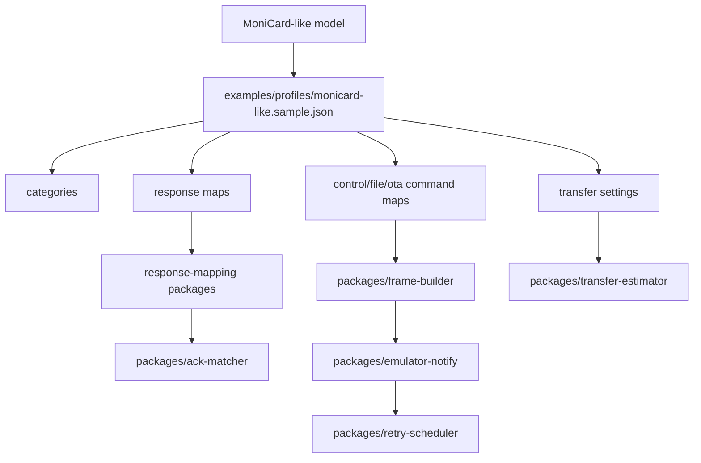

# MoniCard-like profile notes

This document describes the public-safe MoniCard-like compatibility model used by this starter kit.

It intentionally avoids vendor cloud details, private identifiers, captured application code, official assets, firmware blobs, and extracted package artifacts. Values here should be treated as a clean-room compatibility profile for user-owned badge experiments, not as a vendor specification.


## Confidence labels

This document uses these labels:

| Label | Meaning |
|---|---|
| Model rule | Behavior used by this starter kit's public compatibility model |
| Sample value | Neutral value used by the public sample profile |
| Compatibility assumption | A practical shape used for clean-room experimentation, not a vendor guarantee |
| Safety boundary | A line this repository should not cross |

Category values, command names, UUIDs, packet formulas, and response layouts in this document are profile-model details. Do not treat them as universal constants or vendor specifications.

## Implementation mapping



| Concept | Public implementation location |
|---|---|
| Category values | `examples/profiles/monicard-like.sample.json` under `categories` |
| CONTROL command names | `controlCommands` in the sample profile |
| FILE command names | `fileCommands` in the sample profile |
| OTA command names | `otaCommands` in the sample profile |
| CONTROL responses | `controlResponses` and `packages/control-response-mapping` |
| FILE / OTA responses | `fileResponses`, `otaResponses`, and `packages/response-mapping` |
| Packet index behavior | `transfer.includePacketIndex`, `packetIndexBytes`, `packetIndexBase` |
| Packet sizing | `transfer.packetFormula`, `minPacketSize`, `maxPacketSize` |
| CRC-32/MPEG-2 | `packages/frame-builder` and `packages/ota-local-verifier` |
| ACK matching | `packages/ack-matcher` |
| Retry behavior | `packages/retry-scheduler` |
| Virtual notify behavior | `packages/emulator-notify` |
| Windows peripheral sample | `apps/windows-ble-peripheral/MCardBlePeripheral` |
| Safe parser extensions | `examples/plugins/*.rules.json` and `packages/json-rule-parser` |

## Scope

The profile models a small BLE display badge that can:

```text
report basic device information
accept media-like FILE transfers
accept local OTA planning frames for synthetic packages
respond with notification frames
store or rotate display content
expose simple control settings
```

## BLE shape

**Label: Compatibility assumption / Sample value.**


A compatible badge workflow can be modeled as one primary custom service with write and notify behavior.

The public sample uses neutral UUIDs:

```text
service: 7a2f0000-2b3c-4d5e-8f90-000000000000
write:   7a2f0002-2b3c-4d5e-8f90-000000000000
notify:  7a2f0002-2b3c-4d5e-8f90-000000000000
```

Real devices may use different UUIDs. Keep UUIDs in profiles or local settings.

## Frame family

**Label: Model rule.**


The transport can be modeled with three command families:

```text
CONTROL
FILE
OTA
```

The sample category values are:

```text
OTA     0x01
FILE    0x04
CONTROL 0x1f
```

These are profile values. Do not make core code depend on them.

## Outer frame

All frame families share a compact outer envelope:

```text
uint8  category
uint8  fragmentState
uint16 payloadLengthLE
bytes  payload
```

Fragment state values:

```text
0 complete frame
1 first fragment
2 middle fragment
3 last fragment
```

## CONTROL payload

CONTROL frames use command plus data:

```text
uint16 commandLE
bytes  data
```

Common CONTROL concepts:

```text
serial number query
version query
battery query
storage information query
control settings query
control settings write
card/content metadata query
card/content metadata write
carousel or rotation interval query
carousel or rotation interval write
```

Response payloads are small and usually decode as one of:

```text
ASCII/UTF-8 string
u16le scalar
u32le scalar
bit/flag bytes
small fixed struct
```

## FILE payload

FILE frames use command, data length, and data:

```text
uint16 commandLE
uint16 dataLengthLE
bytes  data
```

Typical FILE transfer stages:

```text
session start
send-start metadata
data packet
send-end
session end
lost-packet check
file information query
```

A data packet can include a little-endian packet index before content bytes. The sample transfer builder uses packet index base 1.

## OTA payload

OTA planning frames use the same length-prefixed command shape as FILE frames:

```text
uint16 commandLE
uint16 dataLengthLE
bytes  data
```

Typical OTA planning stages:

```text
OTA start
OTA data packet
OTA end
```

In this starter kit, OTA remains local verification and planning only. The project does not flash firmware.

## Packet sizing

**Label: Compatibility assumption.**


A practical packet size can be derived from MTU.

The sample formula is:

```text
packetSize = 50 * (mtu - 7) - 8
```

Then clamp to a safe range:

```text
minimum: 256
maximum: 10240
```

Treat this as a profile parameter, not a universal BLE rule.

## CRC behavior

**Label: Model rule for the included public implementation.**


FILE package helpers use CRC-32/MPEG-2.

Parameters:

```text
poly:      0x04C11DB7
init:      0xffffffff
reflected: false
xorout:    0x00000000
```

Test vector:

```text
"123456789" -> 0x0376e6e7
```

## Padding behavior

FILE payload data can be padded to a 4-byte boundary before CRC data is appended.

The public implementation keeps this as package-builder behavior so other profiles can choose different rules.

## ACK and response behavior

A compatible notification response can be modeled as:

```text
outer frame
  -> response command
  -> response data length
  -> response data
```

For FILE and OTA ACK-style responses, the data often works well as:

```text
uint16 statusLE
uint32 packetIndexLE
```

A status value of zero is treated as success by the sample parser. Non-zero status values should be treated as NACK or error unless a profile says otherwise.

## Lost-packet checks

A lost-packet response can be represented as:

```text
uint16 statusLE
uint32 lostPacketIndexLE[]
```

The retry scheduler can use this list to queue retransmission.

## Media assumptions

A compatible display profile generally assumes:

```text
small color display
portrait-oriented content
static image or frame animation
bounded package size
limited write throughput
```

The sample tools normalize media toward 240x320 PNG frames, but profiles can declare other limits.

## Transfer timing

Transfer timing depends on:

```text
MTU
write rate
connection interval
ACK delay
retry rate
packet count
frame byte count
browser BLE behavior
device storage speed
```

The estimator is intentionally approximate. Validate on real hardware.

## Response mapping strategy

Prefer response maps in profile JSON:

```text
controlResponses
fileResponses
otaResponses
```

When a response is too irregular for response maps, prefer JSON rule parser files before adding executable parser code.

## Clean-room line

**Label: Safety boundary.**


Allowed in this repository:

```text
public-safe frame shapes
neutral sample UUIDs
profile-driven command names
locally generated test vectors
synthetic package containers
user-owned device experiments
```

Not allowed:

```text
vendor cloud endpoints
private identifiers
official assets
captured application code
firmware blobs
extracted package artifacts
```

## Implementation hint

When a behavior feels device-specific, put it in:

```text
examples/profiles/*.json
examples/plugins/*.rules.json
docs/MONICARD_LIKE_PROFILE_NOTES.md
```

Avoid putting it in generic core modules.
