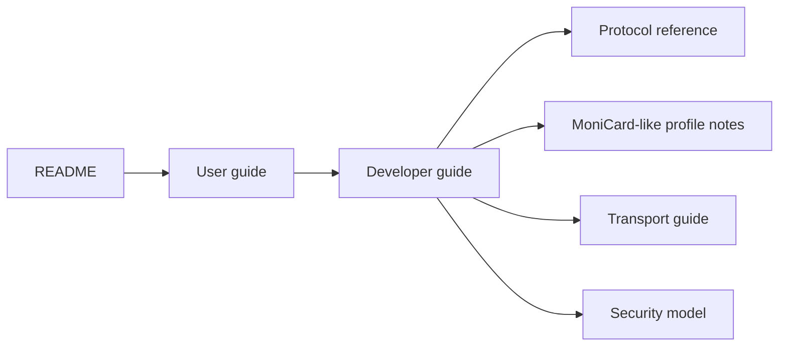
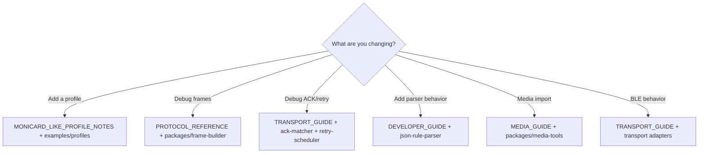

# Documentation

MCard-StarterKit is a local-first clean-room starter kit for Bluetooth animated badge experiments.

## Start here

## Documents

- [User guide](USER_GUIDE.md)
- [Developer guide](DEVELOPER_GUIDE.md)
- [MoniCard-like profile notes](MONICARD_LIKE_PROFILE_NOTES.md)
- [Protocol reference](PROTOCOL_REFERENCE.md)
- [Media and package guide](MEDIA_GUIDE.md)
- [Transport guide](TRANSPORT_GUIDE.md)
- [Hardware planning](HARDWARE.md)
- [Security model](SECURITY.md)

## Developer reading paths

## Principles

- Keep device behavior profile-driven.
- Keep transfer and parser logic local-first.
- Keep BLE writes explicit and opt-in.
- Do not include vendor assets, cloud endpoints, captured app code, firmware blobs, or private identifiers.
