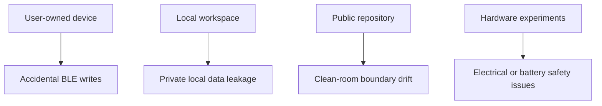

# Security model

## Defaults

- Local-first operation.
- No vendor cloud calls.
- No official assets.
- No captured application code.
- No firmware blobs.
- Explicit confirmation before BLE writes.
- OTA tooling is local verification and planning only.

## Clean-room contribution rules

Do not add:

- vendor cloud endpoints,
- official assets,
- captured application code,
- firmware blobs,
- private IDs or tokens,
- HAR files or extracted package artifacts.

## BLE caution

BLE writes can affect user-owned devices. Keep transports opt-in and profile-driven.

## Threat model

## Protected

- User-owned device safety.
- Local workspace data.
- Clean-room repository boundary.
- Accidental BLE write prevention.

## Out of scope

- Production security certification.
- Firmware authenticity verification.
- Vendor cloud compatibility.
- Hardware electrical safety certification.
