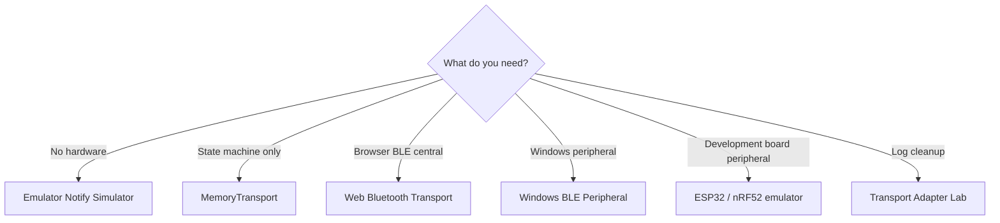
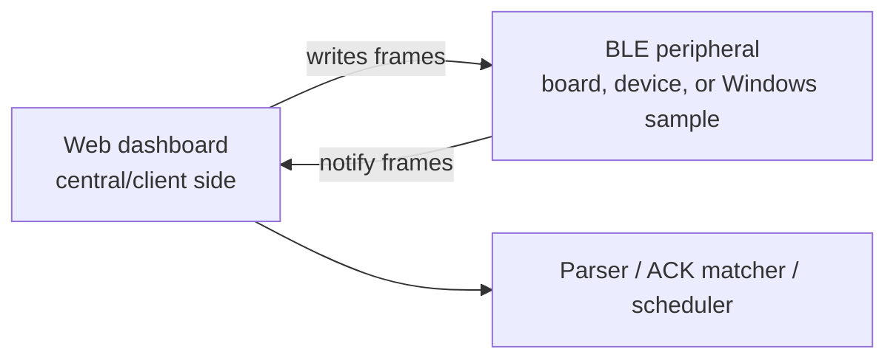

# Transport guide


## Which transport should I use?

| Situation | Use |
|---|---|
| No hardware, test parser and retry behavior | Emulator Notify Simulator |
| Test transfer state machine only | MemoryTransport |
| Test browser BLE write path | Web Bluetooth Transport |
| Test peripheral behavior on Windows | Windows BLE Peripheral |
| Test a physical development-board peripheral | ESP32 / nRF52 BLE emulator |
| Normalize logs after testing | Transport Adapter Lab |
| Estimate transfer duration before testing | Transfer-time estimator |



## Transport types

The project includes:

- Web Bluetooth opt-in transport,
- in-memory transport for deterministic local testing,
- emulator notification simulation,
- Windows BLE peripheral source sample,
- ESP32 and nRF52 hardware BLE peripheral examples,
- transport log adapters.

## Web Bluetooth

Web Bluetooth writes require explicit user action and safety confirmation.

## Emulator notify simulator

The simulator converts CONTROL, FILE, and OTA request frames into virtual notifications based on the active profile. This allows local testing without hardware.

## Retry scheduler

The scheduler connects parsed notifications to retry behavior. ACK matching can be done per packet index.

## Windows BLE peripheral sample

The Windows sample advertises a local GATT service and returns virtual notifications when frames are written. It requires an explicit local-test flag.

Build and test it on a Windows host with .NET 8, Windows SDK, and a Bluetooth adapter that supports peripheral role.

### Prebuilt Windows package

Tags matching `v*` run `.github/workflows/windows-emulator-release.yml` on a
Windows GitHub Actions runner. The workflow publishes a self-contained x64 ZIP
to the matching GitHub Release:

```text
mcardkit-windows-emulator-<tag>-win-x64.zip
SHA256SUMS-windows
```

Extract the ZIP and run `.\run-local-test-peripheral.ps1`. The launcher supplies
the required local-test consent flag and the neutral sample service, write, and
notify UUIDs. A manual workflow run produces an Actions artifact without
publishing a Release.

The package is unofficial local test software for Windows 10 2004 or later. It
requires a Bluetooth adapter and driver with peripheral-role support. It does
not flash firmware or contact vendor services.

## ESP32 / nRF52 hardware BLE emulator

The examples in `examples/esp32-ble-peripheral/` and
`examples/nrf52-ble-peripheral/` make a development board advertise as
`MCardKit-Emu`.

They expose these neutral sample identifiers:

```text
Service: 7a2f0000-2b3c-4d5e-8f90-000000000000
Write:   7a2f0002-2b3c-4d5e-8f90-000000000000
Notify:  7a2f0003-2b3c-4d5e-8f90-000000000000
```

Build one target with PlatformIO:

```bash
pio run -d examples/esp32-ble-peripheral
pio run -d examples/nrf52-ble-peripheral
```

Upload and monitor the selected board:

```bash
pio run -d examples/esp32-ble-peripheral -t upload
pio device monitor -b 115200
```

Use the nRF52 directory in the upload command for an nRF52840 DK. Port
selection depends on the host; use PlatformIO's `--upload-port` or `--port`
options when needed.

Dashboard connection remains opt-in:

1. Start the local dashboard and open it in a Chromium-based browser.
2. Enter the sample service, write, and notify UUIDs in Web Bluetooth
   Transport.
3. Confirm the own-device authorization checkbox.
4. Select Connect and choose `MCardKit-Emu`.
5. Enable notifications.
6. Explicitly write a generated CONTROL, FILE, or OTA planning frame.

Expected version-query serial log:

```text
RX 1F 00 02 00 14 00
TX 1F 00 07 00 15 00 30 2E 31 2E 30
```

Known FILE and OTA requests receive deterministic status-zero ACKs. Invalid or
unknown frames produce a serial warning and no notification. OTA handling is
planning/verification behavior only; the examples do not flash real devices.

### GitHub Release packages

Tags matching `v*` trigger the hardware emulator release workflow. For example:

```bash
git tag v0.2.0
git push origin v0.2.0
```

After both PlatformIO builds pass, the workflow creates or updates the GitHub
Release for that tag and uploads ESP32 and nRF52 ZIP packages plus
`SHA256SUMS`. Each package includes generated binaries, the matching public
example source/configuration, flashing notes, and per-file checksums.

The packages are unofficial builds of this repository's public-safe emulator.
They are not vendor firmware and must only be written to the documented
development-board target. A manual workflow run produces temporary Actions
artifacts without publishing a Release.


## Central and peripheral roles



## Web Bluetooth requirements

- Chromium-based browser is recommended.
- A secure context is required; `localhost` is acceptable.
- Device selection must be triggered by a user gesture.
- The user must select the device.
- Service and characteristic UUIDs must match local settings or the active profile.
- iOS Safari support is limited or unavailable for this workflow.
