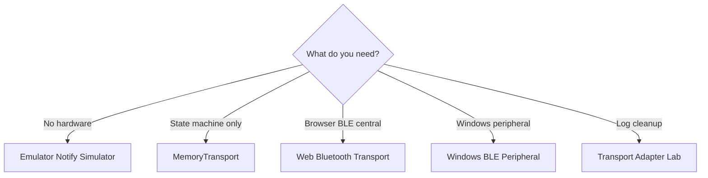
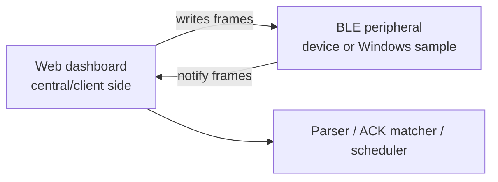

# Transport guide

## Which transport should I use?

| Situation | Use |
|---|---|
| No hardware, test parser and retry behavior | Emulator Notify Simulator |
| Test transfer state machine only | MemoryTransport |
| Test browser BLE write path | Web Bluetooth Transport |
| Test peripheral behavior on Windows | Windows BLE Peripheral |
| Normalize logs after testing | Transport Adapter Lab |
| Estimate transfer duration before testing | Transfer-time estimator |

## Transport types

The project includes:

- Web Bluetooth opt-in transport,
- in-memory transport for deterministic local testing,
- emulator notification simulation,
- Windows BLE peripheral source sample,
- transport log adapters.

## Web Bluetooth

Web Bluetooth writes require explicit user action and safety confirmation.

## Emulator notify simulator

The simulator converts CONTROL, FILE, and OTA request frames into virtual notifications based on the active profile. This allows local testing without hardware.

## Retry scheduler

The scheduler connects parsed notifications to retry behavior. ACK matching can be done per packet index.

## Windows BLE peripheral sample

The Windows sample advertises a local GATT service and returns virtual notifications when frames are written. It requires an explicit local-test flag.

Build and test it on a Windows host with .NET 8, Windows SDK, and a Bluetooth adapter that supports peripheral role.

## Central and peripheral roles

## Web Bluetooth requirements

- Chromium-based browser is recommended.
- A secure context is required; `localhost` is acceptable.
- Device selection must be triggered by a user gesture.
- The user must select the device.
- Service and characteristic UUIDs must match local settings or the active profile.
- iOS Safari support is limited or unavailable for this workflow.
