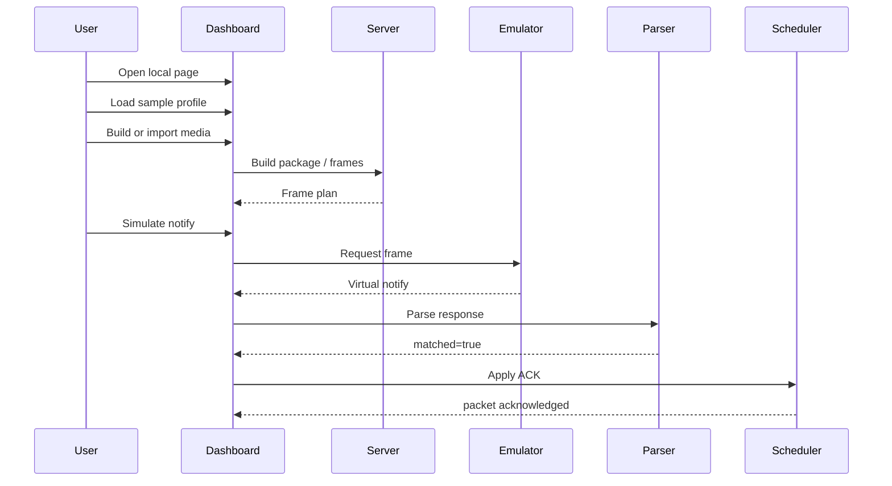
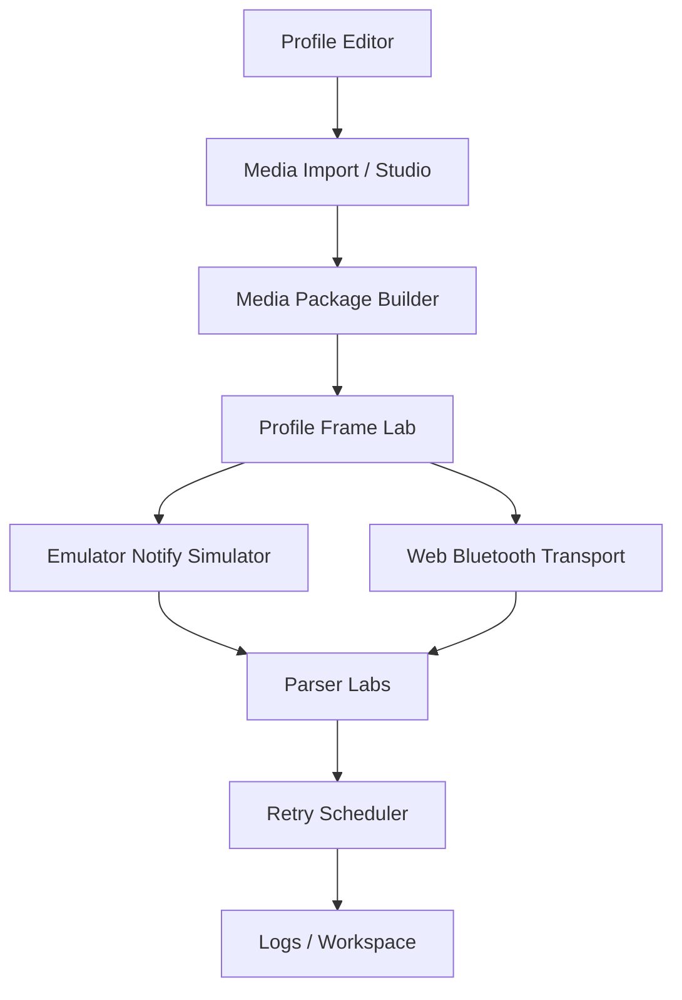

# User guide

This guide shows the dashboard workflow in the order a new developer should try it.

## Start the dashboard

```bash
PORT=3000 npm start
```

Open:

```text
http://127.0.0.1:3000
```

## First successful local flow



## Step-by-step with panel names

### 1. Confirm the server is alive

Command:

```bash
curl -s http://127.0.0.1:3000/api/health
```

Expected output:

```json
{
  "ok": true
}
```

### 2. Open the dashboard

Panel to look for:

```text
Profile Editor
```

Expected result:

```text
The dashboard loads without asking for a cloud account or external service.
```

### 3. Load a sample profile

Panel:

```text
Profile Editor
```

Action:

```text
Load or select examples/profiles/monicard-like.sample.json
```

Expected output in the profile editor:

```text
categories
fileCommands
controlCommands
otaCommands
transfer
```

### 4. Create or import media

Use one of these panels:

| Goal | Panel | Action |
|---|---|---|
| Static image | Media Studio | Load or draw a small 240x320 image |
| Animation | Animation Studio | Build a short frame animation |
| GIF/APNG/WebP | Browser-native Media Import | Choose file, then click Import native media |

Expected output:

```text
A local media or animation source is available.
```

### 5. Build a media package

Panel:

```text
Media Package Builder
```

Action:

```text
Build media package
```

Expected output:

```text
Package JSON appears in the package output area.
```

### 6. Build profiled FILE frames

Panel:

```text
FILE Transfer Simulator or Profile Frame Lab
```

Action:

```text
Build profiled frames
```

Expected output:

```json
{
  "totalPackets": 1
}
```

Any non-zero `totalPackets` means the package was converted into transfer frames.

### 7. Simulate a notification

Panel:

```text
Emulator Notify Simulator
```

Action:

```text
Paste or reuse a request frame, then click Simulate notify.
```

Example request frame:

```text
1f 00 02 00 14 00
```

Expected output:

```text
A virtual notify frame is generated.
```

### 8. Parse the response

Panel:

```text
CONTROL Response Parser
FILE / OTA Response Parser
JSON Rule Parser Lab
```

Action:

```text
Paste the notify hex and parse it.
```

Expected output:

```json
{
  "matched": true
}
```

### 9. Apply ACK behavior

Panel:

```text
Retry Scheduler Lab
```

Action:

```text
Load frames, send next, then apply parsed notification.
```

Expected output:

```text
The packet state becomes ack, or retry state is updated.
```

### 10. Export workspace

Panel:

```text
Workspace
```

Action:

```text
Export workspace
```

Expected output:

```text
A local workspace JSON is downloaded or copied.
```

## Dashboard map



Read this diagram from top to bottom. A profile and media package become frames. Frames produce notifications. Notifications become parsed responses and scheduler state.

## Troubleshooting

| Symptom | Check |
|---|---|
| Dashboard does not open | Confirm `PORT=3000 npm start` is still running |
| `/api/health` fails | Check terminal output from the server |
| No profiles appear | Check `examples/profiles/` exists |
| Frame plan has zero packets | Build or paste a package first |
| Parser returns `matched: false` | Confirm category, command, and response map match the active profile |
| Web Bluetooth cannot connect | Use a Chromium-based browser and trigger connection from a user gesture |

## Safety notes

OTA features in this project are for local package verification and frame planning. They do not flash firmware.

Web Bluetooth writes require explicit user action and confirmation.
