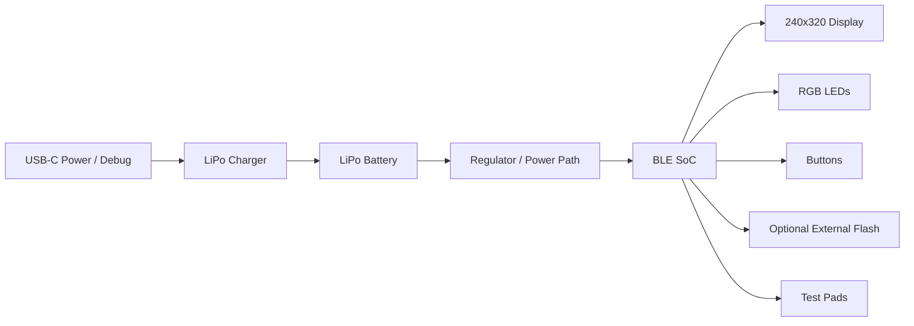

# Reference block diagram

```mermaid
flowchart LR
  USB[USB-C Power / Debug] --> CHG[LiPo Charger]
  CHG --> BAT[LiPo Battery]
  BAT --> PMIC[Regulator / Power Path]
  PMIC --> SOC[BLE SoC]
  SOC --> LCD[240x320 Display]
  SOC --> LED[RGB LEDs]
  SOC --> BTN[Buttons]
  SOC --> FLASH[Optional External Flash]
  SOC --> TP[Test Pads]
```

This is a planning diagram only. It is not a certified schematic.
