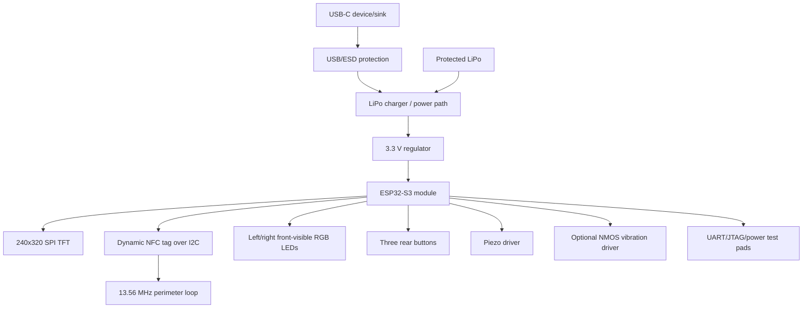

# V1 architecture

The BLE antenna occupies one short board edge. The NFC loop uses the remaining
perimeter and includes a tuning/matching area accessible during bring-up.
Placement starts with antenna exclusions, display/FPC, USB-C, and battery,
before convenience routing.

The full placement-aware block contract, including battery connector,
backlight control, EN/BOOT, battery voltage measurement, and no-header test
access, is in `CIRCUIT_ARCHITECTURE.md`.

Firmware remains local-first and profile-driven. USB programming/debug and BLE
actions require explicit user action. NFC is a host-updatable tag, not a field
generator or reader.
