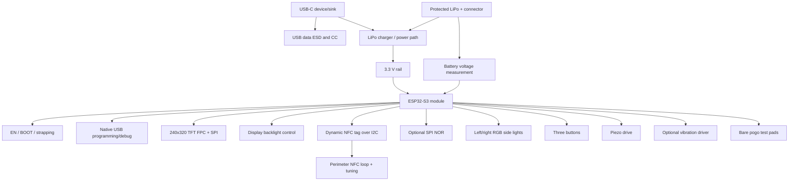

# V1 circuit architecture

This expands the current PR-3 schematic scaffold into explicit review blocks.
It is a planning architecture only, not electrical verification or fabrication
approval. Exact symbols, pinouts, footprints, values, and JLCPCB assembly state
remain `TODO: VERIFY`.

## Required schematic blocks

| Block | Required content | Placement dependency |
|---|---|---|
| USB-C input | VBUS/GND, separate CC1/CC2 sink resistors, shield strategy | Board edge and case opening |
| USB programming/debug | ESP32-S3 native USB D+/D-, recovery path | Short referenced pair; connector and ESD geometry |
| USB ESD | Low-capacitance D+/D- protection and short ground return | Immediately behind receptacle |
| LiPo charger / power path | Input/charge limits, status, TS/NTC decision, thermal pad | Away from pouch and antennas; thermal spreading |
| Battery connector | Polarity, mating harness, strain relief, protected-cell assumptions | Cable exit and expanded battery volume |
| 3.3 V rail | Regulator, inductor, decoupling, enable, transient budget | Compact hot loop away from BLE/NFC |
| ESP32-S3 module | Supply, decoupling, GPIO allocation, EN, BOOT, straps | Upper-right edge, exact antenna keepout |
| TFT connector | SPI, reset/DC/CS, exact FPC pin order and contact side | Display lower edge and reviewed bend direction |
| Backlight control | Default-off PWM/control and panel-specific current path | Near FPC while isolating switching noise |
| Dynamic NFC tag | I2C, pull-ups, GPO/FD, energy-harvest decision | Near tuning network without breaking loop |
| NFC loop/tuning | Perimeter loop, links, DNP tuning parts, measurement pads | Board perimeter excluding BLE/USB/mechanics |
| Optional SPI NOR | Safe DNP state, CS, HOLD/WP, decoupling | Keep bus routing controlled; no antenna intrusion |
| RGB side lights | Supply/current limiting, data direction, decoupling | Coupled to bilateral case light guides |
| Buttons | Three inputs, idle state, debounce intent, strap-safe GPIOs | Existing lower-rear horizontal axes |
| Piezo | Defined-off drive and reviewed amplitude/frequency | Reserved acoustic cavity and port |
| Optional vibration | DNP motor pads, driver, pulldown, reviewed clamp | Outside RF/power-sensitive and battery areas |
| Battery measurement | Divider/switching strategy, ADC range, leakage/filtering | Quiet ADC route away from switching loops |
| Test pads | GND, VBUS, VBAT, 3V3, EN, BOOT, UART, USB, I2C, SPI, loads | Fixture-accessible bare pads; no pin headers |

The legacy `ARCHITECTURE.md` remains a compact overview. This file is the
placement-aware schematic block contract for the PR-3 correction.
