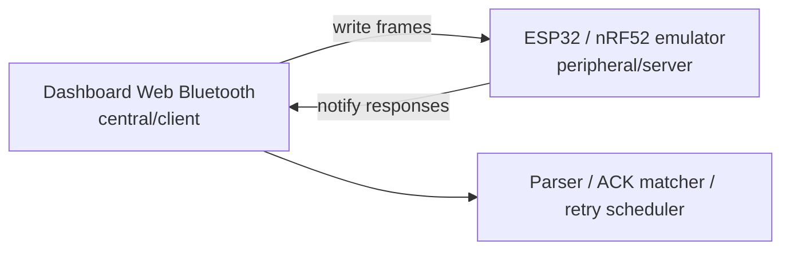

# ESP32 / nRF52 BLE Peripheral Emulator Implementation Task

## Goal

Add real-hardware BLE peripheral emulator examples for ESP32 and nRF52.

These examples should let the browser dashboard's Web Bluetooth transport connect to a physical dev board acting as a sample MoniCard-like peripheral.

This is a public-safe compatibility emulator. It is not official firmware and must not include vendor assets, vendor cloud behavior, captured application code, or real OTA flashing logic.

## Why

Browser Web Bluetooth can act as a central/client, but it cannot normally emulate a BLE peripheral/server.

A physical board can fill that role:



## Target directories

Implement at least ESP32 first.

Preferred layout:

```text
examples/
  esp32-ble-peripheral/
    README.md
    platformio.ini
    src/main.cpp
    include/mcard_profile.h

  nrf52-ble-peripheral/
    README.md
    platformio.ini
    src/main.cpp
    include/mcard_profile.h
```

If nRF52 cannot be completed in the same pass, add a compile-friendly skeleton and clear TODOs.

## Required BLE model

Use neutral public sample UUIDs.

```text
Service UUID:
7a2f0000-2b3c-4d5e-8f90-000000000000

Write Characteristic UUID:
7a2f0002-2b3c-4d5e-8f90-000000000000

Notify Characteristic UUID:
7a2f0003-2b3c-4d5e-8f90-000000000000
```

The emulator must:

- advertise as `MCardKit-Emu`
- expose the service UUID
- expose write characteristic
- expose notify characteristic
- accept frame bytes on write
- notify a deterministic response
- log input and output hex to serial

## Frame model

Outer frame:

```text
uint8  category
uint8  fragmentState
uint16 payloadLengthLE
bytes  payload
```

CONTROL payload:

```text
uint16 commandLE
bytes  data
```

FILE / OTA payload:

```text
uint16 commandLE
uint16 dataLengthLE
bytes  data
```

Sample categories:

```text
OTA     0x01
FILE    0x04
CONTROL 0x1f
```

Fragment states:

```text
0 complete
1 first
2 middle
3 last
```

## Required emulator responses

### 1. CONTROL version query

Input example:

```text
1f 00 02 00 14 00
```

Return:

```text
1f 00 07 00 15 00 30 2e 31 2e 30
```

This represents:

```json
{
  "group": "control",
  "commandName": "VERSION_RESPONSE",
  "value": "0.1.0"
}
```

### 2. FILE data packet ACK

When receiving FILE data-like frames, return:

```text
04 00 0a 00 09 00 06 00 00 00 01 00 00 00
```

Use the input packet index if present. Otherwise use packet index `1`.

### 3. OTA planning data packet ACK

When receiving OTA data-like frames, return:

```text
01 00 0a 00 29 00 06 00 00 00 01 00 00 00
```

Use the input packet index if present. Otherwise use packet index `1`.

### 4. Unknown command

For unknown commands, do not crash.

Return one of:

- a generic error response
- a status non-zero ACK
- a serial-only warning with no notify

Prefer deterministic behavior and document it.

## ESP32 implementation notes

Use Arduino framework with PlatformIO if possible.

Preferred `platformio.ini`:

```ini
[env:esp32dev]
platform = espressif32
board = esp32dev
framework = arduino
monitor_speed = 115200
```

BLE library options:

1. NimBLE-Arduino, preferred if lightweight
2. ESP32 Arduino BLEDevice, acceptable if simpler

Example structure:

```cpp
setup()
  Serial.begin(115200)
  initBle()
  startAdvertising()

loop()
  blink status or idle delay

onWrite(bytes)
  print RX hex
  parse outer frame
  build response
  notify response
  print TX hex
```

## nRF52 implementation notes

Use PlatformIO with Arduino framework if possible.

Candidate board:

```ini
[env:nrf52840_dk]
platform = nordicnrf52
board = nrf52840_dk
framework = arduino
monitor_speed = 115200
```

If nRF52 code cannot be made robust in one pass:

- add README
- add config header
- add skeleton `main.cpp`
- document required board and library
- add TODO checklist

## Shared constants

Put constants in:

```text
include/mcard_profile.h
```

Should contain:

- UUID strings
- advertised name
- category constants
- sample command constants
- helper comments

## Host-side docs to update

Update:

```text
README.md
docs/TRANSPORT_GUIDE.md
docs/HARDWARE.md
docs-ja/TRANSPORT_GUIDE.md
docs-ja/HARDWARE.md
```

Add:

- how to build
- how to flash
- how to open serial monitor
- how to connect from dashboard
- expected serial logs
- safety caveats

## Test additions

Add:

```text
tests/hardware-emulator-static-test.js
```

It should check:

- ESP32 emulator files exist
- nRF52 emulator files or skeleton exist
- sample UUID strings exist
- advertised name exists
- no forbidden extensions
- docs mention hardware emulator
- README mentions ESP32 or nRF52
- no `BUILD_REPORT.txt`

Add it to `package.json` test script.

Do not make default `npm test` require PlatformIO unless the environment already has it.

## Suggested implementation sequence

1. Inspect current repository structure.
2. Add ESP32 emulator example.
3. Add nRF52 implementation or skeleton.
4. Add docs.
5. Add static test.
6. Update `package.json`.
7. Run `npm test`.
8. Fix clean-room audit failures.
9. Confirm no binary artifacts were added.
10. Produce a concise summary.

## Acceptance criteria

The task is complete when:

- `npm test` passes
- clean-room audit passes
- ESP32 example is present
- nRF52 example is present as implementation or clearly scoped skeleton
- docs explain how to use the hardware emulator
- README mentions hardware BLE emulator examples
- no forbidden artifacts are added
- BLE writes remain opt-in on the browser side
- emulator uses neutral sample UUIDs
- implementation is clearly labeled as public-safe and unofficial

## Non-goals

Do not implement:

- vendor cloud login
- official app compatibility claims
- firmware flashing to real devices
- proprietary OTA package formats
- captured mobile app protocol dumps
- automatic BLE write on browser page load
- secret token handling
